# auto-task-plugin

End-to-end autonomous task workflow for Claude Code. Takes a task description from intake to pull request with mechanical enforcement of every protocol invariant.

## How it works

The pipeline runs unattended between two anchor points: the **Phase-1 plan** (a human gate in `supervised` mode; recorded but not waited on in `autonomous`) and the **merge gate** — the single mandatory human stop before work lands, as a PR merge or a direct-to-main merge per your landing model. High-risk runs always stop at the merge gate regardless of mode. Progress is durably recorded in `STATE.json`, so an interrupted run resumes where it paused.

```mermaid
flowchart TD
    Start(["/auto-task &lt;description&gt;"]) --> Setup
    Setup["SETUP · pre-flight<br/>version check · first-run setup (autonomy · landing · telemetry) · pull main · fresh worktree"] --> Recon

    subgraph P1["PHASE 1 · DEFINE"]
        direction TB
        Recon["Recon · score effort tier + risk · clarify Q&amp;A"]
        Plan["Write PLAN.md + acceptance criteria + assumptions ledger"]
        Approve{"Plan approval<br/>supervised = human gate · autonomous = recorded, not waited on"}
        Recon --> Plan --> Approve
    end

    Approve -->|revise| Plan
    Approve -->|approved / auto-approved| Execute

    Execute["PHASE 2 · EXECUTE<br/>implement plan — one growing diff, no commits"] --> Verify
    Verify["PHASE 3 · SELF-VERIFY<br/>/auto-task-verify · types·unit·lint·build"]
    Verify -->|pass| GateA
    GateA{"GATE A · completeness<br/>runs on every tier"} -->|contract met| Review
    Review["PHASE 4 · CODE REVIEW<br/>auto-task-code-review · 5-phase"] -->|clean| GateB
    GateB{"GATE B · adversarial<br/>STANDARD / HEAVY"} -->|clean| Handover
    GateB -.->|LIGHT tier skips| Handover

    Verify -->|fail| Fix
    GateA -->|findings| Fix
    Review -->|blocker / required| Fix
    GateB -->|findings| Fix
    Fix["auto-task-fix<br/>then re-verify + re-review"] --> Verify

    Fix -.->|loop rule: no progress · out of scope · blocked · flaky| Surface(["STOP &amp; surface to user"])
    Execute -.->|interrupt-now: ambiguity · destructive op · test integrity · budget| Surface

    subgraph P5["PHASE 5 · HANDOVER"]
        direction TB
        Handover["re-sync main · single commit · CONTEXT.md"]
        Merge{"MERGE GATE — the one mandatory human stop<br/>required when supervised, autonomous+direct, or risk >= threshold"}
        Handover --> Merge
    end

    Merge -->|hold| Done(["✓ done"])
    Merge -->|ack| Land["LAND<br/>pr: push + open/merge PR · direct: merge to default branch"]
    Merge -.->|autonomous + low-risk pr: auto-ack| Land
    Land --> Done
    Land -.->|post-PR, if applicable| P6

    subgraph POST["POST-PR — optional · each runs only if its condition holds"]
        direction TB
        P6["PHASE 6 · Bot-comment review<br/>opt-in: bot_review_autofix"]
        P7["PHASE 7 · Preview verification<br/>opt-in / auto-learned"]
        P8["PHASE 8 · External change apply<br/>only if external actions declared"]
        P6 -.-> P7 -.-> P8
    end
    P8 -.-> Done

    classDef human fill:#fbf1de,stroke:#b5730a,stroke-width:2px,color:#3a2a05;
    classDef gate fill:#dcf1f2,stroke:#0d7b83,stroke-width:2px,color:#043033;
    classDef phase fill:#e9edfd,stroke:#3550d6,stroke-width:1.5px,color:#0f1a52;
    classDef fix fill:#eee7fb,stroke:#6b40cf,stroke-width:1.5px,color:#2a1358;
    classDef term fill:#e0f2e6,stroke:#1f8a4c,stroke-width:2px,color:#0a3d20;
    classDef stop fill:#fbe3e3,stroke:#c92a2a,stroke-width:1.5px,color:#5c0d0d;
    classDef cond fill:#eaeef3,stroke:#5a6675,stroke-width:1.5px,stroke-dasharray:5 4,color:#28313c;

    class Approve,Merge human;
    class GateA,GateB gate;
    class Setup,Recon,Plan,Execute,Verify,Review,Handover,Land phase;
    class Fix fix;
    class Start,Done term;
    class Surface stop;
    class P6,P7,P8 cond;
```



**Legend — solid border = always runs · dashed border = optional / conditional.** 🟦 phase / action · 🟨 human gate · 🟩 independent verifier gate (A/B) · 🟪 fix / review loop · ⬜ optional post-PR phase · 🟥 stop &amp; surface.

**Where the human stops (autonomy × landing model, chosen once at first-run setup):**

| mode | `pr` landing | `direct` landing |
|---|---|---|
| `supervised` (default) | plan approval + push/PR prompt | plan approval + prompt before landing |
| `autonomous` | plan recorded; low-risk auto-acks (disclaimer in PR body) | plan recorded; **merge-gate ack** before landing |

Any run with `effort.risk >= risk_gate_threshold` forces the **merge gate** regardless of mode. The **interrupt-now gates** (ambiguity · destructive op · test integrity · budget) can halt the run during any unattended phase, not just Phase 2.

**Always runs:** Setup → Define → Execute → Self-verify → Gate A → Code review → Handover → merge gate. **Conditional:** Gate B runs on STANDARD/HEAVY only (LIGHT skips it). **Optional (opt-in / only when applicable):** Phase 6 bot-comment review, Phase 7 preview verification, Phase 8 external-change application. Effort tier (LIGHT / STANDARD / HEAVY, scored in Phase 1) sets the verify scope, fix-loop cap, and whether Gate B runs.

## Autonomy modes & the merge gate (v0.22)

auto-task can run in two modes, chosen once per project in a **first-run setup** (four questions: telemetry, autonomy, landing style, unattended-external):

- **`supervised`** (default) — today's behavior: one human gate at plan approval, plus the push prompt.
- **`autonomous`** — the procedural gates go silent and the run proceeds unattended; the **merge is the sole mandatory human gate**. Safety comes from *exception-triggered* interrupts that stop the run only on real trouble: **ambiguity** (hard stop for a decision it can't resolve with evidence), a **destructive / out-of-envelope command** (blocked by `guard-dangerous-ops.sh` unless `unattended_external` is on), **test integrity** (tests weakened to reach green), and a soft **budget-blowout** check-in. High-risk runs (`effort.risk >= risk_gate_threshold`) force the merge gate on regardless of mode, showing a red disclaimer + an **assumptions ledger** of every call the run made unattended.

> **Settings reset on this update.** The settings file is version-stamped; the first `/auto-task` after upgrading to 0.22 backs up (`settings.json.pre-<n>`) and clears each project's settings so the one-time setup re-runs and telemetry is re-consented. Your shared **global** settings file is never touched — restore prior values by copying the backup back.

## What it ships

- **`auto-task` skill** — the orchestrator. Composes the six bundled sibling skills and the verifier agent across the pipeline (Define → Execute → Self-verify → Review → Handover, plus an optional post-push Preview-verification phase).
- **`hooks/settings.sh` — project settings (opt-in).** Reads a per-project, per-user JSON settings file kept **outside your repo** (`~/.claude/auto-task/<project-key>/settings.json`), with a built-in default for every key. First key: `has_preview_deployment`, which turns on the post-push preview verification. See "Project settings (opt-in)" below. Pure, fail-open, `tests/settings.test.sh`.
- **Six namespaced sibling skills** — `auto-task-plan`, `auto-task-implement`, `auto-task-verify`, `auto-task-code-review`, `auto-task-commit`, `auto-task-fix`. Forked from the upstream skills and patched to participate in the read-before-review contract. The `auto-task-` prefix keeps them distinct from your existing `/plan`, `/verify`, etc.; under a marketplace install they are further namespaced (`auto-task:auto-task-plan`), and under the `install.sh` fallback they keep the bare `auto-task-plan` form.
- **`task-execution-verifier` agent** — read-only verifier spawned at Gate A (completeness) and Gate B (adversarial). Fresh context per spawn.
- **`auto-task-stats` skill** — standalone, read-only maintainer tool (NOT part of the pipeline). Reports local run-outcome telemetry: completion rate, where runs stall, per-tier fix/review effort, Gate B coverage. See "Run telemetry (opt-in)" below. Invoke as `/auto-task:auto-task-stats` (marketplace) or `/auto-task-stats` (install.sh fallback).
- **`auto-task-gc` skill** — standalone disk/worktree cleanup tool (NOT part of the pipeline). Reports each auto-task worktree's size, age, and merge status, then safely reclaims the merged/stale ones on confirmation (branch refs preserved, matching `.auto-task/<branch>/` pruned). Retention is per branch type and fully defaulted/overridable. See "Worktree space control" below. Invoke as `/auto-task:auto-task-gc` (marketplace) or `/auto-task-gc` (install.sh fallback).
- **`auto-task-resume` skill** — standalone run picker (NOT part of the pipeline). Lists every auto-task run across your worktrees — state, title, effort, last activity — in a clean table, lets you pick one, and continues it from where it left off. Fixes the `claude --resume` gap (that resumes a *conversation*, not a *run*). Backed by the read-only `hooks/auto-task-resume-list.sh` engine (`tests/auto-task-resume-list.test.sh`). See "Resuming runs" below. Invoke as `/auto-task:auto-task-resume` (marketplace) or `/auto-task-resume` (install.sh fallback).
- **Core hooks**, all wired automatically by the plugin install (`hooks/hooks.json`) —
  - `block-ai-attribution.sh` (PreToolUse on Bash): refuses commits and PR bodies containing `Co-Authored-By: Claude`, `🤖 Generated`, etc.
  - `enforce-gates.sh` (PreToolUse on Bash): blocks `git commit` during an auto-task run unless `gates.code_review.passed`, `gates.code_review.tool === "skill:auto-task-code-review"`, `gates.code_review.clean_pass_after_last_fix`, and Gate B's gate (or skip reason) are all satisfied. It also enforces **review staleness** — if `git diff <base>` no longer hashes to the recorded `gates.code_review.reviewed_diff_sha`, code changed after the review went clean and the commit is blocked until a re-review. It also carries the **checkout-drift block** — a `git commit` while the working tree sits on a branch other than an active in-place run's branch is blocked (previously a silent fail-open). Fails closed: with `jq` missing or `STATE.json` unparseable during an active run, it blocks rather than letting the commit through.
  - `warn-checkout-drift.sh` (PreToolUse on Bash): informational, NEVER blocks. Warns on every command when an active run exists on a branch other than the one checked out (the proactive half of the checkout-drift guard; the enforce-gates block is the mechanical half). Silent and near-free in non-auto-task repos.
  - `prevent-mid-protocol-stall.sh` (Stop event): blocks turn-ends mid-pipeline by reading `expected_next_action` from STATE.json. The antidote to sub-skill output looking completion-shaped.
  - `record-outcome.sh` (Stop event): **opt-in, never blocks.** When `.auto-task/outcomes.jsonl` exists and a run reaches `phase: done`, appends one derived JSON row (fields from STATE.json — no network, no new data). A base-keyed sentinel makes it write once per run. Silent no-op unless opted in. Read by `auto-task-stats`. See "Run telemetry (opt-in)".
  - `send-telemetry.sh` (Stop event): **opt-in, off by default, never blocks.** The **remote** counterpart to `record-outcome.sh` — when `telemetry_enabled`+`telemetry_endpoint` are set (see "Remote telemetry"), POSTs an anonymized quality/perf row to your HTTPS endpoint at `phase: done`. Bounded, fail-open, write-once per run. Silent no-op unless opted in.
  - `check-version.sh` (SessionStart): best-effort update notice. Once per 24h it compares the installed version against the published `plugin.json` on GitHub and, if you're behind, prints a one-line reminder to run `/plugin update auto-task@auto-task-plugin`. Fails open and silent when current, offline, or unparseable — this cached SessionStart notice never blocks or slows a session. **Per-run version check:** on top of that notice, `/auto-task` Phase 1 runs a fresh **per-run version check** (the same script via `--plain`, throttle bypassed) at the start of every NEW run and, if you're behind, asks once whether to auto-apply the update (via `hooks/apply-update.sh` — no manual command) or proceed on the current version. It is separately bounded (`--connect-timeout 2 -m 5`) and fully fail-open — it never blocks the run and never touches the SessionStart throttle stamp. Skipped on resume.
  - `suggest-cleanup.sh` (SessionStart): best-effort, non-destructive worktree-cleanup nudge. Cheap and **local-only** (no `du`, no network) and throttled once per `worktree_cleanup_throttle_hours` **per clone**; when ≥1 auto-task worktree looks reclaimable (merged, or clean-and-stale past its per-type threshold) it prints a one-line suggestion to run `/auto-task-gc`. Never deletes, never blocks; fails open and silent, and is gated off by `worktree_cleanup_nudge: false`. See "Worktree space control".
- **`inject-history-reminder.sh`** (`UserPromptSubmit`, opt-in): tells non-bundled tools that an `.auto-task/<branch>/` history folder exists for the current branch. **Wired but OFF by default** — it stays silent unless you enable it with `settings.sh set history_reminder_enabled true` (works identically for marketplace and `install.sh`). Even when enabled it emits nothing outside auto-task branches, so unrelated prompts pay no token cost.
- **`settings-fragment.json`** — fallback only. The marketplace install wires the hooks for you; this snippet is for the offline/dev `install.sh` path (and the optional recommended-permissions block). The history reminder is wired in both install paths and gated by the `history_reminder_enabled` setting — no snippet edit is needed to enable it.

## Install (marketplace — recommended)

This repo is its own plugin marketplace. From inside Claude Code:

```
/plugin marketplace add o8o0o8o/auto-task-plugin
/plugin install auto-task@auto-task-plugin
```

That copies the plugin into your plugin cache and **auto-wires everything** — the ten skills, the `task-execution-verifier` agent, and all eight core hooks (`hooks/hooks.json`). No `settings.json` editing, no symlinks, no `install.sh`.

Plugin skills are namespaced under the plugin name, so you invoke the orchestrator as:

```
/auto-task:auto-task <plain-English task description>
```

and the siblings as `/auto-task:auto-task-plan`, `/auto-task:auto-task-fix`, etc.

### Updating

**Auto-apply (no command to type).** When a newer version exists, the next `/auto-task` run offers to update — choose **"Update it for me (auto-apply)"** and the bundled `hooks/apply-update.sh` applies it for you, detecting your install layout automatically:

- **Marketplace install** → runs `claude plugin update auto-task@auto-task-plugin` (at your install scope).
- **Offline / development install** (git clone via `install.sh`) → runs `git pull --ff-only` in the clone. Fast-forward only — it never forces and never switches your branch, so be on the release-tracking branch (`main`) to pull a release; a dirty/diverged/no-upstream tree fails cleanly with a message instead of clobbering your work.
- **Copy install** (`install.sh --copy`) → cannot self-update (files were copied with no source link); re-run `install.sh` from your clone.

**Restart to load.** An update *stages* the new version but the running session keeps the old code — hooks load at session start and a marketplace update needs a restart to apply. So after auto-apply, **restart Claude Code** and re-run `/auto-task`; re-invoking in the same session would reload nothing.

You can also run the updater standalone (`bash hooks/apply-update.sh`) or update by hand:

```
/plugin update auto-task@auto-task-plugin
```

The bundled `check-version.sh` SessionStart hook also reminds you (at most once per day) when a newer version has been published, so you don't have to remember to check. Updates ship only when the maintainer bumps `version` in `plugin.json`.

### Optional / opt-in

- **`inject-history-reminder.sh`** (`UserPromptSubmit`) — lets non-bundled tools discover the per-branch history folder so they honour the read-before-review contract. Wired in every install but **gated OFF by default**; enable with `settings.sh set history_reminder_enabled true` (`false` to disable). It emits nothing outside auto-task branches, so unrelated prompts pay no token cost. Enabling via a settings key — rather than a pasted `settings.json` snippet — is what makes it reachable on a marketplace install, where the plugin lives in an opaque, per-version cache dir that `${CLAUDE_PLUGIN_ROOT}` can't expand into `settings.json`.
- **Recommended permissions** — the inert `_optional_recommended_permissions` block in `settings-fragment.json` denies bare `git push` and asks before `gh pr create`, turning the Phase 5 push prompt into a mechanical gate. Not required (the skill already prompts once), and it affects all your work, so it's opt-in.

## Install (offline / development — fallback)

If you can't use the marketplace (air-gapped, or hacking on the plugin itself), `install.sh` symlinks the skills + agent into `~/.claude/` and prints a hooks snippet to merge into `~/.claude/settings.json`:

```sh
git clone https://github.com/o8o0o8o/auto-task-plugin.git ~/.claude/auto-task-plugin
cd ~/.claude/auto-task-plugin
./install.sh
```

It symlinks the ten skills into `~/.claude/skills/` and the verifier agent into `~/.claude/agents/`, then prints a settings snippet with absolute paths for the hooks. Merge that snippet into `~/.claude/settings.json` — preserve your existing keys, append to the `hooks.PreToolUse` / `hooks.Stop` arrays if they already exist. The skills load without the merge, but the gate-enforcement and anti-stall hooks won't fire. With this path the skills are invoked by their bare names (`/auto-task`), not namespaced.

Pass `--copy` instead of the default to copy files (no symlinks), or `--uninstall` to remove the links. To update: `git pull` inside the clone (symlinks pick up changes automatically; if you used `--copy`, re-run `./install.sh`). The SessionStart update-notice fires under either install path — `check-version.sh` self-locates its manifest (via `${CLAUDE_PLUGIN_ROOT}` under the marketplace install, or relative to its own path for the `install.sh`/symlink layout).

## Hard prerequisites

- `git` ≥ 2.30
- `gh` (GitHub CLI) for PR creation
- `jq` (used by the hook scripts)
- `curl` (used by the SessionStart update-notice hook; absence just disables the notice)
- `bash` ≥ 3.2 (the version macOS ships with works; POSIX `sh` does not — the hook scripts use bash features)

## Usage

### Start a new run

```
/auto-task <plain-English task description>
```

The skill creates a branch, sets up the per-branch history folder at `.auto-task/<branch>/`, runs Phase 1 reconnaissance (read-only — Playwright, Context7, Figma, etc.; any link in the card is loaded **two-tier** — an ordinary fetch first, a Playwright fallback when that returns no usable data — and videos like Loom get screenshots + transcript, with `hooks/extract-links.sh` classifying the links as a mechanical assist, and a focused test under `tests/`), asks clarifying questions, selects an implementation approach when more than one is viable (generating and scoring candidates, surfacing close calls to you), builds an Acceptance Criteria table, critiques the plan and auto-repairs its structural gaps, and presents a plan for your approval.

**Forward clarifying questions to the ticket owner.** The person running `/auto-task` often isn't the one who owns the ticket and holds the answers, so when Phase 1 has open questions (or folds an approach choice to you) it **first asks how you want to handle them** — a routing question with two options: **answer them here**, or **get a paste-ready ticket comment to forward**. Choose *answer here* and the questions appear as pickers; choose *forward* and it renders the comment (short, human-like, no names, no greetings, functionality only) and **pauses** — you drop it into the ticket, then resume `/auto-task` with the owner's answers and it picks up where it left off. Making the comment a first-class choice (rather than an easy-to-miss aside) is what guarantees it always shows up.

**Comments in your voice (`VOICE.md`).** Every comment the pipeline drafts — the Phase-1 ticket comment, the Phase-5 PR title/body, and the Phase-7 preview verdict comment — is written in the voice from a `VOICE.md` when one exists. Resolution takes the first non-empty file of **project-local `<repo>/.claude/VOICE.md`** (wins) then **global `~/.claude/VOICE.md`**; with no `VOICE.md` at either level it falls back to the built-in default style. Voice shapes only the free prose — it never overrides hard rules (no AI-attribution, the ticket comment's no-names/no-greetings/functional-only contract, or the PR body's structured tables/checklist/diagram). It's fail-open and silent: a missing or empty file just means defaults, and it adds no prompt, stop, or gate.

**Every run has a title.** Phase 1 derives a concise **run title** from your task and surfaces it so you can tell sessions apart at a glance — it prefixes every sub-agent's status label (the running-agent line reads `<title> · Gate B adversarial verify`) and leads each phase message with a `▶ auto-task: <title> — Phase N` banner. It's purely cosmetic — derived locally, no tracker integration, and it changes no gate or control flow.

After you type `approved` / `proceed` / `yes`, the pipeline runs unattended through:

- **Phase 2** Execute — invokes the bundled `auto-task-implement` skill; drift-checks each checkpoint against the plan's Blast Radius.
- **Phase 3** Self-verify — invokes `auto-task-verify`; runs every Acceptance Criterion bound to the `self-verify` gate.
- **Gate A** — spawns `task-execution-verifier` in `completeness` mode; runs every Acceptance Criterion bound to `gate-a`.
- **Phase 4** Code review — invokes `auto-task-code-review`, applies any blockers / required fixes, re-invokes until the latest pass is clean.
- **Gate B** — spawns `task-execution-verifier` in `adversarial` mode (skipped for `tier=light` tasks).
- **Phase 5** Handover — single commit, push, PR with embedded change diagram. Asks once whether to push & open PR / push only / hold.

### Resume an interrupted run

```
/auto-task
```

(no argument) — reads `.auto-task/<current-branch>/STATE.json` and continues from where it left off. Resume re-enters the phase recorded in `STATE.json` from the top; phases are designed to be re-entrant (re-running self-verify, a gate, or the review loop on the current working tree is idempotent — it recomputes from disk state, it doesn't double-apply). The component preflight (above) re-runs on every resume in case a skill or the verifier agent was uninstalled between sessions.

### Running multiple runs in parallel

Each run is isolated by **branch** and keeps all state under `.auto-task/<branch>/`. Parallel runs in the same repo are now **automatic** — no manual setup:

- **Launch from any branch — it just works.** For every new-description run, Phase 1 forks a fresh `<type>/<slug>` branch **from the repo's default branch** (`main`/`master`, best-effort fetched first) and gives it its OWN git worktree (`git worktree add .claude/worktrees/<type>-<slug> -b <branch> <default-ref>`, then it relocates the session in via the `EnterWorktree` tool). This is unconditional — it does not matter what branch you are currently on or what the shared checkout is doing. Your original checkout is left untouched and free for other work, and a second `/auto-task` started elsewhere gets its own worktree too — git forbids two worktrees on one branch (and names are disambiguated before creation), so they can never collide. The worktree is kept on disk after the run; prune it with `git worktree remove .claude/worktrees/<type>-<slug>` when done.
- **Based on the default branch, not your current HEAD.** Every run starts clean from a current default base, so it never inherits the current checkout's branch or uncommitted WIP. A run started while on a feature branch forks fresh from the default rather than continuing that branch — to base a run on specific work, prepare a worktree for it by hand (below) and run `/auto-task` inside it.
- **Manual worktrees still work** if you want to base a run on specific existing work:

  ```sh
  git worktree add ../auto-task-feat-x -b feat/x   # one worktree per task
  cd ../auto-task-feat-x && claude                  # then run /auto-task here
  ```

  auto-task detects it is already inside a linked worktree and runs in place there, without nesting a second worktree.
- **The in-place fallback is guarded.** If `EnterWorktree`/`git worktree add` is unavailable, the run falls back to the shared checkout — and the **checkout-drift guard** catches the case where that checkout is switched off the run's branch from another terminal: `warn-checkout-drift.sh` warns on every command and `enforce-gates.sh` hard-blocks any commit until you switch back (or clear an abandoned run). Previously this failed open silently.

Each worktree has its own working tree, branch, and `.auto-task/<branch>/` history, and the gate + Stop hooks resolve state per-worktree (via `git rev-parse --show-toplevel`), so concurrent runs never interfere — even though they share one clone's object store and common-dir exclude file. Merge or open a PR from each worktree independently.

### Surfacing protocol

The pipeline stops mid-flight only when the Loop rule fires:

1. No progress (two consecutive iterations with no measurable improvement).
2. Out-of-scope (remaining issues don't map to the approved AC).
3. External blocker (missing creds, broken infra, undecided design).
4. Test flakiness (non-deterministic failure).

You get a status with **why stopped** + **current state** + **suggested next move**. Resume with `/auto-task` (or `/auto-task-resume` to pick from all runs — see below).

## Resuming runs (`/auto-task-resume`)

Each run lives in its own git worktree keyed to a branch (`.auto-task/<branch>/STATE.json` **inside that worktree**). Two consequences: `claude --resume` resumes a *conversation session*, not a run, so it can drop you somewhere with no run in sight; and bare `/auto-task` (no args) only knows about the run on the branch you happen to be on. When several runs are in flight across worktrees, neither lands you where you meant to go.

**`/auto-task-resume`** is the picker that fixes this. It enumerates every run on the clone (scanning each `git worktree list` path for a `STATE.json` — a bare worktree with no state is never listed), prints a clean table, and lets you choose:

```
  auto-task runs — my-app  (4 found)
  ────────────────────────────────────────────────────────────────────────
   #     STATE       TITLE                                  EFFORT  LAST
  ────────────────────────────────────────────────────────────────────────
   1) ● gate-b      Apply & verify external CMS changes    standard 39m ago
   2) ○ done        Sync comments, code & docs             light   3h ago
   3) ● review      Worktree cleanup nudge                 standard 18h ago  · current
   4) ● execute     Add reCAPTCHA to order approval        heavy   2d ago    · orphan
  ────────────────────────────────────────────────────────────────────────
  ● resumable   ○ done   ⚠ unreadable    markers: · current (you're here) · orphan (worktree pruned)
```

Pick a run with an arrow-key prompt (it offers only the resumable runs — done and current ones stay in the table for context), and it enters that run's worktree and hands off to the standard resume, continuing from the recorded phase. An **orphaned** run (state survives but its worktree was pruned) is offered a one-step recreate (`git worktree add`) first. It's read-only discovery — nothing is written or removed without your say-so.

Bare **`/auto-task`** (no args) also uses this now: it consults the engine's `--resume-mode` and shows the picker when runs exist beyond your current branch, resumes directly when the only run is your current branch's, or asks for a description when there are none.

## Read-before-review contract

When the bundled `auto-task-code-review`, `auto-task-verify`, or `auto-task-fix` skill runs in a repo with an existing `.auto-task/<branch>/` folder, it reads `CONTEXT.md` and `TRACE.md` first so it doesn't re-litigate decisions or miss real issues that earlier reviewers flagged but never followed up on.

**For third-party tools that want to participate:** the contract is "if `.auto-task/$(git branch --show-current)/` exists, read `CONTEXT.md` and `TRACE.md` before forming findings; append a new TRACE entry on completion (block format documented in `skills/auto-task/SKILL.md`)." Adopt this in your own tool to interoperate.

## Recommended project memories

Auto-task reads `~/.claude/projects/<slug>/memory/MEMORY.md` during Phase 1 recon. Useful entries to maintain per-project:

- **`feedback_no_unrequested_commits.md`** — `"continue"` / `"proceed"` should not authorize commits; only an explicit `"commit"` does.
- **`feedback_subagents_dangerous_git.md`** — sub-agents should never run `git reset --hard`, `git push --force`, or similar in dispatch prompts.
- **`project_team_review_policy.md`** — who must review PRs touching specific paths.
- **`reference_external_systems.md`** — pointers to Linear / Notion / Slack channels where decisions are tracked.

The plugin does NOT ship memory entries. They are per-user, per-project, opt-in.

## What does NOT happen

- The plugin never commits anything under `.auto-task/` — that folder is local-only, gitignored via the common-dir exclude (`$(git rev-parse --git-common-dir)/info/exclude`) on branch setup.
- The plugin never writes to your memory store. Phase 1 reads it; Phase 5 surfaces candidate memories for you to save if you choose. No autonomous writes.
- The plugin never bypasses hooks. Pre-commit hook block → fix the underlying state, don't `--no-verify`.
- The plugin never adds `Co-Authored-By: Claude` or `🤖 Generated` markers — both the skill and the hook enforce this.

## Troubleshooting

| Error message | Meaning | Fix |
|---|---|---|
| `Blocked by auto-task-plugin: auto-task run in progress` | The gate-enforcement hook fired because gates haven't passed. | Read the message — it names which gate is missing. Re-run the relevant skill and update the flag with real evidence. Do NOT speculatively set flags. |
| `auto-task is mid-pipeline (phase=…)` | The Stop hook fired because `expected_next_action === "auto-continue"`. | This is the anti-stall block working as intended. Make the next tool call instead of trying to end the turn. |
| `commit messages and PR bodies must NOT contain "Co-Authored-By: Claude"` | The AI-attribution hook fired. | Rewrite the commit message / PR body without the marker. |
| `.auto-task/` showing up in `git status` as untracked | The exclude entry didn't land. | Append `.auto-task/` to `$(git rev-parse --git-common-dir)/info/exclude` (worktree-correct — in a worktree `.git` is a file, so the bare `.git/info/exclude` path fails). |
| `the working-tree diff changed since the last clean code-review pass` | Code was edited after the code-review gate went clean, so the staleness check fired. | Re-run the `auto-task-code-review` skill on the current diff, drive it to a clean pass, then refresh `gates.code_review.reviewed_diff_sha`. Do not bypass. |
| `jq is not installed` / `STATE.json is not valid JSON` (hook block) | A hook failed closed because it couldn't verify state during an active run. | Install `jq`, or repair/remove `.auto-task/<branch>/STATE.json` if no run is active. |

## Project settings (opt-in)

Per-project, per-user configuration for the pipeline. **Optional and fully defaulted** — a project with no settings file behaves exactly as it did before this feature existed.

- **Kept OUTSIDE your repo.** Settings live at `${AUTO_TASK_HOME:-$HOME/.claude}/auto-task/<project-key>/settings.json`. The `<project-key>` is derived from the repo's git **common dir** (`git rev-parse --git-common-dir`), which every worktree of one clone shares — so settings are **project-specific and per-clone** (all worktrees resolve to the same file), and a setting **never alters your repo** (nothing is written in the working tree; it never appears in `git status`).
- **JSON, with fallback.** A flat `key: value` object. Any key you omit falls back to the built-in default — the single source of truth is the `default_for` table in `hooks/settings.sh`. A missing file, malformed JSON, or an absent key all resolve to defaults (the reader is fail-open and never errors a run).
- **Two scopes: global + project.** Besides the per-project file, a **global** file at `${AUTO_TASK_HOME:-$HOME/.claude}/auto-task/settings.json` applies to every project. They merge as `defaults ⊔ global ⊔ project` — the **project file wins**, so you can set a default globally and override it (either direction) per clone. Both scopes are optional.
- **Managing them.** `bash hooks/settings.sh path` prints the project file location; `bash hooks/settings.sh init` seeds a project template and `bash hooks/settings.sh init --global` seeds the global one; `bash hooks/settings.sh get <key>` / `all` read the merged values. (The orchestrator reads them automatically in Phase 1.)

Recognized keys (v1):

| Key | Default | Meaning |
|---|---|---|
| `has_preview_deployment` | `false` (unset) | Whether the project has a preview deployment. **Auto-learned when unset:** on a post-PR run, `/auto-task` detects whether a deployment exists and **persists only a positive** here (found → `true`, verified every run thereafter). A non-detection is **not** persisted — the setting stays unset and re-learns next run, so a slow/degraded check can never leave a permanent wrong `false`. Set an explicit `false` to skip (and stop the per-run re-check); explicit `true`/`false` is honored and never overwritten. |
| `preview_autodetect` | `true` | Gates auto-learn: on each undecided post-PR run (until a positive resolves or you set an explicit value), when `has_preview_deployment` is unset and a PR is opened, poll its comments for a deployment URL (Vercel/Netlify/Cloudflare/… bot comment) and persist a positive result (`true`) — zero config. A non-detection is never persisted (stays unset, re-learns next run). Set `false` to disable auto-learn (unset then means "no preview", nothing persisted). |
| `preview_url` | `""` | Optional preview URL template (fallback when `gh` finds no deployment); `{branch}` is substituted. |
| `preview_wait_mode` | `"poll"` | `poll` = bounded in-session wait for the deploy; `handoff` = defer the check to a later `/auto-task` resume. |
| `preview_timeout_min` | `30` | Max minutes to wait for the preview before recording `pending`. |
| `preview_poll_interval_sec` | `60` | Seconds between readiness polls. |
| `preview_bypass_header` | `""` | Optional `Name: value` header for deployment-protection bypass tokens. |
| `preview_post_verdict_comment` | `false` | When `true`, post the verdict as a PR comment (an external write — off by default). |
| `bot_review_autofix` | `false` | Opt-in: after the PR opens, collect **Cursor/GitHub review-bot** comments and conservatively auto-apply the high-confidence, in-scope fixes (each through the full verify→review→gate→commit→push loop); park the rest. Off by default — enabling grants write authority to your PR branch. See "Post-PR bot-comment review" below. |
| `bot_review_timeout_min` | `10` | Max minutes to poll for bot comments after the PR opens. |
| `bot_review_poll_interval_sec` | `30` | Seconds between bot-comment polls. |
| `bot_review_bots` | `""` | Extra bot logins to treat as review bots (space/comma-separated), beyond the built-in list + any `[bot]`/`type:Bot` account. |
| `external_actions_mode` | `"ask"` | How **Phase 8** applies an external-system change (CMS edit, feature-flag toggle, live data migration, third-party API config). `ask` (default) = ask once for permission + credentials, then run the script and verify — fall back to a runbook if declined. `runbook` = never auto-run; always emit a runbook and wait. `auto` = pre-authorized to run without the prompt (any *irreversible* action still prompts; unreachable creds degrade to runbook). Gates only *how* it applies — **detection + the "not done until applied" marking are always-on**, never gated. See "External change application" below. |
| `external_actions_timeout_min` | `30` | Max minutes Phase 8's in-session **settle-poll** (an `auto`-run apply whose external effect is asynchronous) waits for the change to propagate before surfacing. A `runbook`/`awaiting-external` human handoff does **not** poll — it yields and waits for a `/auto-task` resume — so this bound does not apply there. |
| `external_actions_poll_interval_sec` | `60` | Seconds between Phase-8 settle-poll cycles. |
| `visual_assets_enabled` | `false` | Opt-in: embed **before/after screenshots** in PRs for visual changes (uploaded to **Cloudinary**, embedded inline). Off by default; `/auto-task` asks once per repo (only on UI-scoped runs) before enabling. Off → verification still runs locally; the PR gets a local-artifact + preview note instead. Requires `cloudinary_cloud_name` + `cloudinary_upload_preset`. See "Visual PR proof" below. |
| `cloudinary_cloud_name` | *(bundled)* | Cloudinary cloud name uploads go to. Defaults to a **bundled shared** disposable cloud so opt-in embedding works out of the box; override with your own (or `AUTO_TASK_CLOUDINARY_DEFAULT_CLOUD`). Not a secret — it's in every delivery URL. |
| `cloudinary_upload_preset` | *(bundled)* | The **unsigned** upload preset. Defaults to the bundled preset; override with your own (or `AUTO_TASK_CLOUDINARY_DEFAULT_PRESET`). Not a secret. An unsigned preset is world-writable, so self-hosters should restrict their own (allowed formats/size, fixed folder, moderation). |
| `telemetry_enabled` | `false` | Opt-in for **remote** anonymous telemetry. Default OFF. See "Remote telemetry" below. |
| `telemetry_endpoint` | *(bundled)* | HTTPS ingest URL the anonymized row is POSTed to. **Defaults to the bundled central collector** (shipped in `hooks/settings.sh`); override to self-host. Must be `https://…` — a non-https/empty value sends nothing. |
| `telemetry_ingest_token` | *(bundled)* | Bearer token sent as `Authorization: Bearer …`. **Defaults to the bundled PUBLIC write-only key** (world-readable by design; a leak only permits junk writes). Override to self-host, or clear it to send no auth header. |
| `telemetry_satisfaction_prompt` | `true` | When telemetry is on, whether Phase 5 asks a satisfaction/correctness question at the push prompt. |
| `history_reminder_enabled` | `false` | Opt-in `UserPromptSubmit` hook (`inject-history-reminder.sh`) that tells non-bundled tools an `.auto-task/<branch>/` history folder exists for the current branch. Wired in every install but OFF by default; enable with `settings.sh set history_reminder_enabled true`. Emits nothing outside auto-task branches. |
| `worktree_cleanup_nudge` | `true` | Whether the SessionStart hook nudges you (non-destructively) when reclaimable auto-task worktrees accumulate. Set `false` to silence it. See "Worktree space control" below. |
| `worktree_cleanup_throttle_hours` | `24` | Minimum hours between cleanup nudges, **per clone**. |
| `worktree_cleanup_prune_dirty` | `false` | Whether `/auto-task-gc --prune --yes` may reclaim a **dirty** worktree — by WIP-committing its uncommitted work (tracked + untracked) to its branch first. Off by default: dirty worktrees are kept. |
| `worktree_stale_days_default` | `14` | Days a **clean, unmerged** worktree must be untouched (by last-commit date) before it counts as reclaimable — fallback for any type without its own key. |
| `worktree_stale_days_feat` / `_refactor` | `30` | Per-type stale threshold for `feat/` and `refactor/` branches (longer-lived work). |
| `worktree_stale_days_fix` | `14` | Per-type stale threshold for `fix/` branches. |
| `worktree_stale_days_chore` / `_deps` / `_docs` / `_cleanup` | `7` | Per-type stale threshold for short-lived `chore/`, `deps/`, `docs/`, `cleanup/` branches. |

### Worktree space control (`/auto-task-gc`)

Each `/auto-task` run creates a git worktree under `.claude/worktrees/<type>-<slug>` and **keeps it** so its branch and `.auto-task/<branch>/` history stay available. Because every worktree carries a full working tree (often a multi-GB `node_modules`), they accumulate — a busy repo can reach tens of GB.

Two pieces keep that in check, and **nothing deletes without you asking**:

- **A SessionStart nudge** (`hooks/suggest-cleanup.sh`, on by default) — cheap and local-only (no `du`, no network), throttled once per `worktree_cleanup_throttle_hours` **per clone**. When ≥1 worktree looks reclaimable — **merged**, or **clean and stale** past its per-type `worktree_stale_days_<type>` threshold — it prints a one-line suggestion to run `/auto-task-gc`. It never deletes and never blocks; silence it with `worktree_cleanup_nudge: false`.
- **`/auto-task-gc`** (the `auto-task-gc` skill) — the on-demand tool. `/auto-task-gc` **reports** each worktree's size (`du`), age, type, and merge status (local ancestry **and** `gh` for squash-merged PRs) read-only. `/auto-task-gc --prune` previews the removal plan; `/auto-task-gc --prune --yes` performs it after you confirm. Removal **preserves the branch ref** (committed work is recoverable with `git worktree add <path> <branch>`) and prunes the matching `.auto-task/<branch>/`. Dirty worktrees are kept unless `worktree_cleanup_prune_dirty: true` (then WIP-committed first); the current and main worktrees are never removed; `--all` widens to every clean worktree regardless of merge/age. One caveat: removing a worktree deletes its directory, so **gitignored** files inside it go too (that's the point for `node_modules`, but a local `.env` or other ignored scratch is removed and is *not* captured by the WIP-commit) — the report lists exactly which worktrees will be removed, so run it first.

Retention is **per branch type** so short-lived `chore`/`deps`/`docs`/`cleanup` work is reclaimed sooner than `feat`/`refactor`. Every threshold ships as a default and is overridable, e.g. `bash hooks/settings.sh set worktree_stale_days_feat 45`.

### Post-PR bot-comment review (opt-in)

Set `bot_review_autofix: true` and `/auto-task` adds **Phase 6** after the PR opens: it polls (bounded, default 10 min) for comments left by review bots — Cursor, CodeRabbit, Sourcery, GitHub Copilot review, and any `[bot]`-suffix / GitHub `type:Bot` account (extend via `bot_review_bots`) — via `hooks/pr-bot-comments.sh`, which merges the PR's issue comments, inline review threads, and review summaries into one de-duplicated set. It triages them **conservatively**: only high-confidence, in-scope findings that don't contradict a decision you already made are auto-applied, each routed through the same verify → `auto-task-code-review` → gate → commit → push loop as any other change (so every bot-fix commit is fully re-reviewed before it can land — the pre-commit gate is unchanged). Everything else is parked as a follow-up and reported. It runs exactly one collection round (it does not chase comments its own fix-push re-triggers); a fork-PR / protected-branch push failure is fail-open (parked, never a hard stop). Off by default — enabling it lets the pipeline push bot-derived fixes to your PR branch.

### Visual PR proof (opt-in)

For UI/visual changes, `/auto-task` verifies on **local dev first** (reusing a running dev server, or improvising a bounded, disposable render — Storybook / a test harness / a static build / a mock server — and mocking or seeding only what's needed to reach the *real* UI), then re-checks on the preview when one exists. A UI it can't reach even after improvising is recorded **INCONCLUSIVE** (never a proxied pass), never a hard stop. Playwright sessions and any disposable render are closed when done.

Set `visual_assets_enabled: true` (off by default; `/auto-task` asks once per repo on UI-scoped runs) and the run also embeds a **before/after screenshot pair** in the PR. Images are uploaded to **Cloudinary** via an **unsigned** upload preset — and it works **out of the box** using a **bundled shared** (disposable) Cloudinary account, so no setup is needed to try it. Point `cloudinary_cloud_name` + `cloudinary_upload_preset` at your own account (or the `AUTO_TASK_CLOUDINARY_DEFAULT_*` env vars) to use your own — recommended for real/heavy use, since the shared cloud is a common free-tier pool. The delivery URL renders **inline for public and private projects alike** (GitHub proxies external images through its Camo cache), needs no `gh`, no repo, and no API secret, so it works from any checkout including a fork PR. Two caveats for your own account: an unsigned preset is **world-writable** (restrict it — allowed formats/size, fixed folder, moderation), and unsigned upload **cannot delete**, so screenshots **persist** (the free tier is ample for KB-scale crops). Embedding is best-effort presentation — if the upload returns no `secure_url` (or the keys were overridden empty), the PR just carries a local-artifact + preview note; it never blocks the run.

### Preview verification (opt-in + auto-learn)

When a push happened and a preview is expected, `/auto-task` adds a final **Phase 7** after the PR (and after any Phase-6 bot-fixes): it waits for the preview deployment (bounded, configurable — default 30 min), resolves the preview URL (from `gh` deployment statuses bound to the pushed commit, else the PR's deploy-bot comment, else the configured `preview_url`), re-runs the URL-checkable Acceptance Criteria against the live preview plus a smoke check (loads, no console errors), and records a **final verdict** — `PASS` / `FAIL` / `INCONCLUSIVE` — in `STATE.json`, `CONTEXT.md`, and (optionally) a PR comment. A timeout records `pending` and asks you to resume; a `FAIL` surfaces with evidence (the commit already shipped, so it recommends a follow-up fix rather than auto-looping); an auth-protected (401/403) preview is reported as `INCONCLUSIVE` with a bypass-token hint, never masked.

**Auto-learn (zero config).** You don't have to set `has_preview_deployment`. Left unset, a post-PR run detects whether a preview deployment exists and **persists only a positive**: found → `true` (verified every subsequent run). If none is found, **nothing is persisted** — the setting stays unset and the next post-PR run re-attempts detection, so a slow deploy bot or a degraded check (no `gh`/auth/PR) is a transient miss, never a permanent wrong `false`. The tradeoff is a bounded re-check each post-PR run on a genuine no-preview repo: set `has_preview_deployment: false` explicitly to skip with no polling. An explicit `has_preview_deployment` is always honored and never overwritten; set `preview_autodetect: false` to turn auto-learn off entirely.

### External change application (Phase 8)

Some tasks aren't finished when the code ships — they also need a change in an **external system**: a CMS edit, a feature-flag toggle, a data migration run against live, a third-party API config. Shipping the script that *would* make that change is not the task being done. So `/auto-task` treats these as first-class **external actions**:

- **Declared up front.** In Phase 1 the plan names each external action and adds an Acceptance-Criteria row for it (`Gate = external`) — the target system, how to apply it, and how to verify it took. Detecting external side effects and marking the task not-done are **always-on** (like the honesty floor), never gated by a setting.
- **Applied + verified in Phase 8** (the last phase, after preview verification). By default (`external_actions_mode: ask`) it asks **once** for permission + credentials, runs the change, then re-verifies the external-action ACs plus a smoke check. `runbook` mode never auto-runs — it emits a paste-ready runbook (with a rollback/recovery section) and waits; `auto` pre-authorizes running without the prompt (but any action marked **irreversible** still prompts, and unreachable credentials degrade to a runbook). Credentials are provided at the prompt or via an environment/secret-file reference — **never stored** in settings, state, the trace, or artifacts, and secret-shaped tokens are redacted from captured output.
- **Not done until applied.** A task with an un-applied external change **never reaches `done`** — it stays in an explicit `awaiting-external` (or `declared`, if the push was held) state, and the PR body, run summary, `CONTEXT.md`, and trace all carry a prominent **"⚠ TASK NOT DONE until external changes applied"** banner. Only once the change is applied *and* its post-apply verification passes does the run flip to `done`; Phase 8 then replaces the banner with an "applied + verified" confirmation. Partial multi-action failures stop and surface with per-action rollback steps; resuming skips already-applied actions so an irreversible step never runs twice.
- **Backward-compatible.** A code-only task declares no external actions, Phase 8 is a no-op, and the run completes exactly as before.

## Run telemetry (opt-in)

Off by default. When you want to measure how the pipeline actually performs — completion rate, where runs stall, whether Gate B earns its cost — opt in **per-clone** with:

```sh
touch .auto-task/outcomes.jsonl
```

From then on, every `/auto-task` run that reaches `phase: done` triggers the `record-outcome.sh` Stop hook, which appends **one JSON row** derived entirely from the run's `STATE.json` (tier, fix/review iterations, effort escalations, Gate B outcome, follow-up count, duration). It is **purely local** — no network, and no data beyond what `STATE.json` already stores on disk. A base-keyed sentinel (`.auto-task/<branch>/.outcome-recorded`) makes it write exactly once per run; the ledger lives under the gitignored `.auto-task/` and is never committed. Opt out by deleting the file. The hook never blocks a turn-end and no-ops entirely when the ledger file is absent, so leaving it off costs nothing.

Read the aggregated report with:

```
/auto-task:auto-task-stats            # marketplace install
/auto-task-stats                      # install.sh fallback
/auto-task-stats 14                   # override the stale-run threshold (days; default 7)
```

The reader merges the archived ledger with every live `.auto-task/*/STATE.json` on disk (so in-flight and stalled runs — which never reach the ledger — are still counted), de-duplicating on branch+base. Sample output:

```
auto-task run stats  (stale threshold: 7d)
====================================================
5 runs on record — 3 done, 1 stalled, 1 in-flight
Completion rate    75%  (3/4 terminal; in-flight excluded)

Where stalled runs died
  feat/stalled @ phase=review — stuck on flaky test

By tier
  tier       #done     med fix     med review   escalated
  heavy          1           4              3          0%
  light          1           0              1          0%
  standard       1           2              2        100%

Gate B coverage        ran on 2/2 standard+heavy runs (0 skipped)
Effort mis-scoring     33% of completed runs escalated tier mid-run
Follow-up debt         1.3 parked follow-ups per completed run (avg)

Run metrics (estimate vs actual, quality signals)
Estimate accuracy      tokens: actual/est median 1.15x (n=3)
                       time:   actual/est median 0.9x (n=3)
Late-defect rate       33% of completed runs had a late (Gate-B) defect
Flakiness rate         0% of completed runs hit a flaky test
Tests-added rate       100% of completed runs touched a test file
```

A live, approved, non-`done` run whose newest history entry is older than the stale threshold is reported as **stalled**; newer than it, **in-flight**. "Gate B coverage" is how many STANDARD/HEAVY runs actually ran the adversarial gate to a pass (vs. were skipped) — derived from the recorded `gate_b` outcome. (A per-run "did Gate B catch a bug" count isn't reported: the orchestrator doesn't record a Gate B bounce as a distinct `STATE.json` signal, only as a review-loop iteration, so it can't be reconstructed after the fact without changing pipeline behavior.)

### Remote telemetry (opt-in, off by default)

The telemetry above is **local only** — nothing leaves your machine. If you want to send the same quality/performance signals to a central endpoint (to build a cross-user dashboard later), there is a **separate, explicit, off-by-default** remote path. It is independent of the local `outcomes.jsonl` opt-in.

**You are asked once per repo.** The first time you run `/auto-task` in a repo with no telemetry decision recorded, Phase 1 asks a single consent question — *"Share anonymous auto-task telemetry from this repo?"* — with **Enable** / **No thanks (don't ask again)**. Your answer is saved to that project's settings (`telemetry_enabled: true` or `false`), so you're never asked again for that repo. Declining is remembered as a decision. It's off until you answer; a headless run with no prompt available just stays off.

**Or set it yourself** with a single key in the [project or global settings](#project-settings-opt-in):

```jsonc
// ~/.claude/auto-task/settings.json (global)  — or  <project-key>/settings.json (project)
{ "telemetry_enabled": true }
```

That's all a user needs — the **destination is pre-wired**. `telemetry_endpoint` and `telemetry_ingest_token` ship with the plugin as built-in defaults pointing at the project's central collector (the `auto-task-plugin-admin` dashboard), so opting in sends there automatically. Only the destination is bundled, **not** the consent — collection stays OFF until you explicitly set `telemetry_enabled: true`.

- **The bundled ingest token is a PUBLIC, write-only key — not a secret.** It ships inside this open-source client, so it is world-readable by design (like a Sentry DSN / analytics write key). A leak only permits appending junk rows: it is write-only, can't read the dashboard, and never carries the Turso credential. The endpoint is protected server-side (rate-limiting); rotate the key to cut off abuse.
- **Self-host** by overriding `telemetry_endpoint` (and `telemetry_ingest_token`) in your settings to point at your own dashboard.
- Because settings merge `defaults ⊔ global ⊔ project`, you can opt in globally and **exclude one project** with `{ "telemetry_enabled": false }` in that project's file (or opt in for just one). A non-https or emptied endpoint sends nothing.
- **Maintainers:** the shipped defaults live in `hooks/settings.sh` (`AUTO_TASK_TELEMETRY_DEFAULT_ENDPOINT` / `_TOKEN`) — set them to your deployed dashboard URL and its `INGEST_TOKEN` at release. `settings.sh get telemetry_endpoint` shows users exactly where data goes.

**What is sent** (when on, once per completed run, at `phase: done`; `schema_version: 2`): the run's quality/perf metrics — tier, effort **difficulty/risk**, escalations, fix/review iterations, Gate B outcome, follow-up count, duration, estimate-vs-actual time + **input/output tokens** (cache-excluded), defects early/late, flaky, tests-added, diff size + **files changed**, first-pass-AC, checks tally, requirements count, drift events, preview verdict — **plus** environment (random install id, plugin version, OS, **Claude model + Claude Code version**), the **change type** (`task_type`, a bounded enum — see the table below; e.g. `feat`/`fix`/… — the branch *prefix* only, never the slug), **bucketed project size + primary language + monorepo flag**, an anonymous **change-heat** signal (churn ratio, hotspot concentration, dirs-touched, max-depth — numbers derived from a *local* path history that never leaves), a schema version, and your Phase-5 satisfaction/correctness answers + optional comment.

**What is NOT sent — it's anonymous by construction:** no task description, no branch name, no repository path, no base commit SHA, and no wall-clock timestamp (the server stamps its own `received_at`). The install id is a random UUID with no personal data. The **one exception** is the optional satisfaction *comment* — free text you type at the prompt, sent verbatim; leave it blank to send nothing free-form.

**Change type (`task_type`).** Each run is labelled with a bounded change-type enum, derived from the branch `<type>` prefix (never the slug) and normalized case-insensitively. Any unrecognized or slash-less prefix folds to `other`, so the set is closed and dashboard-groupable. **`change_type` is a bounded label — no per-run free text** (the only user-authored free text remains the optional satisfaction comment below).

| `change_type` | Meaning |
|---|---|
| `fix` | Bug fix, regression, or broken behavior |
| `feat` | New feature or capability |
| `deps` | Dependency add/remove/bump (manifest / lockfile) |
| `refactor` | Code reorganization with no behavior change |
| `docs` | Docs / README / comments only |
| `chore` | Build/test config, formatting sweeps |
| `cleanup` | Dead-code or file removal |
| `other` | Anything that doesn't fit the labels above |

**Satisfaction prompt.** When telemetry is on, the single existing Phase-5 push prompt gains one extra question — *"Did this run produce a correct, satisfactory result?"* (`yes`/`mostly`/`no`/`skip`) — plus an **optional free-text comment**. So no new interruption point is introduced. Set `telemetry_satisfaction_prompt: false` to collect metrics without the prompt. The comment is the one field that isn't auto-anonymized — it is **whatever you type**, sent verbatim (capped 500 chars) to your endpoint, so leave it blank if you don't want free text to leave the machine.

**Reset or opt out.**
- Opt out: set `telemetry_enabled: false` (or remove the endpoint). Data stops immediately.
- Reset your install id: `rm ~/.claude/auto-task/client-id` — a new random id is generated on the next send.

**Transport.** The client `curl`s the payload to your endpoint with a bounded timeout (`--connect-timeout 2 -m 5`) and is fail-open — a slow or dead endpoint never blocks or breaks a run. It fires once per run (a base-keyed sentinel prevents resends). Implemented in `hooks/send-telemetry.sh`.

**The endpoint + database.** A **reference (undeployed)** ingest server and the Turso/libSQL table schema live under [`server/`](server/README.md): a portable `fetch` handler (`server/ingest.mjs`) that writes to a `runs` table (`server/schema.sql`). You deploy it and provision Turso yourself; the server holds the DB credential so clients never carry one. It is write-only for now (a dashboard is future work).

## Run metrics — estimate vs actual, quality signals

Every run now measures itself and reports it in the final summary (and, if telemetry is opted in, as cross-run trends above).

- **Estimate before execution.** At the Phase-1 approval gate the plan carries an `## Estimate` of wall-clock time and token usage, computed by `hooks/estimate.sh` from the scored tier/difficulty/risk, the Acceptance-Criteria count, and the blast-radius file count. It's a deliberately simple **static heuristic** (no calibration on run #1) — the value is the estimate-vs-actual *trend* over many runs, not any single number.
- **Actual measurement.** At handover, `hooks/token-usage.sh` sums `message.usage` from the session transcript(s) under `~/.claude/projects/<slug>/`, **run-scoped** by `--since <run-start>` (it sums across multiple transcripts, so a resumed / new-session / post-compaction run isn't undercounted). Wall-clock comes from the run's history timestamps. Caveat: token accounting is approximate for sub-agent sidechains and any concurrent unrelated work in the same session. A failed measurement is recorded as `null` (never a fabricated `0`).
- **Estimate vs actual.** The CONTEXT.md and PR carry an `## Estimate vs actual` table (estimated · actual · Δ · ratio) for both time and tokens.
- **Checks manifest.** `## Checks performed` enumerates *every* verification the run executed — typecheck, lint, build, unit, e2e/playwright, each AC bound-check, the universal `hooks/checks.sh` hygiene checks (secret-scan, conflict-markers, debug-artifacts, large-files, diff-size, tests-added), and the Gate A/B findings — each with a pass/fail/warn result. `checks.sh` runs in self-verify; a real secret or leftover conflict marker outside test/fixture paths fails the run.
- **Quality signals — not a score.** `## Quality signals` is a panel (defects caught early vs. late, delivery reliability = estimate accuracy + loop count, scope discipline, completeness, and a maintainability read **reused from the code-review verdict**), with an explicit note of what a single run *cannot* measure (business impact, collaboration, long-term maintainability). There is deliberately **no composite 0–100 score**: a single number invites optimizing to the metric and hides those blind spots. Quality is best read as *signals plus trends over time* — which is what the telemetry section above provides.

The measurement helpers are pure, deterministic, fail-open (they never break a run), and each has a focused test under `tests/`.

## Pruning history & worktrees

Per-branch folders under `.auto-task/` never auto-prune during a run. Reclaim them (and the far larger worktree checkouts) with **`/auto-task-gc`**, which removes reclaimable worktrees and prunes their matching `.auto-task/<branch>/` in one pass — see "Worktree space control" above. For a `.auto-task/<branch>/` folder that has no worktree, `rm -rf .auto-task/<old-branch>/` by hand. Nothing in the plugin depends on stale folders being present.

## License

MIT — see `LICENSE`.

## Status

**v0.17.0 — pre-release.** The install path has been verified in a throwaway directory. The enforcement spine (state-machine ↔ hooks) has an automated integration test — `tests/enforcement-spine.test.sh`, 100 assertions covering the full STANDARD + LIGHT lifecycle, gate ordering, review-staleness (including enforcement during a merge and under hostile git config), raw-mode commit detection, the Stop-hook stall-breaker, the AI-attribution block, the fail-open/fail-closed edges, per-worktree / subdirectory / nested-repo state resolution, the worktree-isolated-run resolution with `CLAUDE_PROJECT_DIR` pinned to the main checkout, the checkout-drift block + warning (`enforce-gates.sh` + `warn-checkout-drift.sh`), and the `check-version.sh --plain` per-run-check behavior. What is **not** yet exercised end-to-end is the *model-follows-the-prose* path: the `task-execution-verifier` agent (Gate A/B) and the orchestrator's phase-driving have a real protocol but have not been run inside a live `/auto-task` against a real task — treat those as functional but not yet battle-tested. File issues on GitHub.
