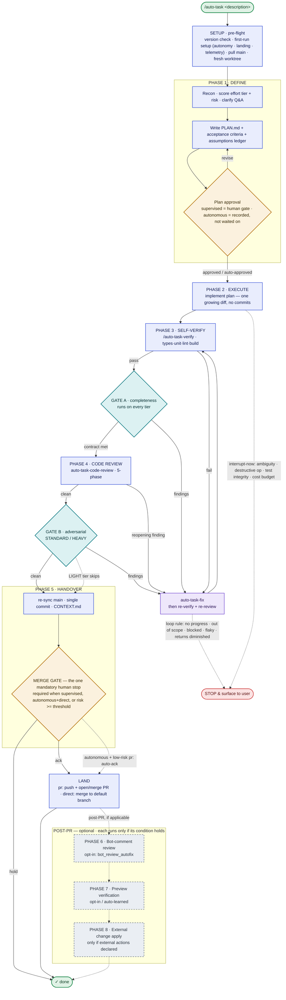

# auto-task-plugin

End-to-end autonomous task workflow for Claude Code. Takes a task description from intake to pull request, with mechanical enforcement of every protocol invariant.

```
/plugin marketplace add o8o0o8o/auto-task-plugin
/plugin install auto-task@auto-task-plugin
```

Then, from any branch:

```
/auto-task:auto-task <plain-English task description>
```

Phase 1 asks clarifying questions and shows you a plan. You approve it. Everything after that runs unattended until the work is ready to land — where it stops once more for your go-ahead.

## Documentation

| Guide | What's in it |
|---|---|
| **[Install & update](docs/install.md)** | Marketplace install, auto-update, release notes, offline/dev fallback, prerequisites |
| **[Usage](docs/usage.md)** | Starting a run, resuming, parallel runs, the run picker, the surfacing protocol |
| **[Architecture](docs/architecture.md)** | The pipeline in detail, autonomy modes, the merge gate, where independent judgment lives |
| **[Settings](docs/settings.md)** | Every configuration key, grouped by feature, with the two-scope merge model |
| **[Optional features](docs/optional-features.md)** | Docs update, release step, bot-comment review, visual PR proof, preview verification, external changes, worktree GC |
| **[Telemetry & metrics](docs/telemetry.md)** | Local run ledger, `/auto-task-stats`, opt-in remote telemetry, estimate-vs-actual |
| **[Components](docs/components.md)** | Every skill, hook, and agent the plugin ships |
| **[Troubleshooting](docs/troubleshooting.md)** | What each hook block means and how to clear it |
| **[Maintainers](docs/maintainers.md)** | Cutting a release, pruning history |

## How it works

The pipeline runs unattended between two anchor points:

1. **The Phase-1 plan** — a human gate in `supervised` mode; recorded but not waited on in `autonomous`.
2. **The merge gate** — the single mandatory human stop before work lands, as a PR merge or a direct-to-main merge, per your landing model.

High-risk runs always stop at the merge gate regardless of mode. Progress is durably recorded in `STATE.json`, so an interrupted run resumes where it paused.


```mermaid
flowchart TD
    Start(["/auto-task &lt;description&gt;"]) --> Setup
    Setup["SETUP · pre-flight<br/>version check · first-run setup (autonomy · landing · telemetry) · pull main · fresh worktree"] --> Recon

    subgraph P1["PHASE 1 · DEFINE"]
        direction TB
        Recon["Recon · score effort tier + risk · clarify Q&amp;A"]
        Plan["Write PLAN.md + acceptance criteria + assumptions ledger"]
        Approve{"Plan approval<br/>supervised = human gate · autonomous = recorded, not waited on"}
        Recon --> Plan --> Approve
    end

    Approve -->|revise| Plan
    Approve -->|approved / auto-approved| Execute

    Execute["PHASE 2 · EXECUTE<br/>implement plan — one growing diff, no commits"] --> Verify
    Verify["PHASE 3 · SELF-VERIFY<br/>/auto-task-verify · types·unit·lint·build"]
    Verify -->|pass| GateA
    GateA{"GATE A · completeness<br/>runs on every tier"} -->|contract met| Review
    Review["PHASE 4 · CODE REVIEW<br/>auto-task-code-review · 5-phase"] -->|clean| GateB
    GateB{"GATE B · adversarial<br/>STANDARD / HEAVY"} -->|clean| Handover
    GateB -.->|LIGHT tier skips| Handover

    Verify -->|fail| Fix
    GateA -->|findings| Fix
    Review -->|reopening finding| Fix
    GateB -->|findings| Fix
    Fix["auto-task-fix<br/>then re-verify + re-review"] --> Verify

    Fix -.->|loop rule: no progress · out of scope · blocked · flaky · returns diminished| Surface(["STOP &amp; surface to user"])
    Execute -.->|interrupt-now: ambiguity · destructive op · test integrity · cost budget| Surface

    subgraph P5["PHASE 5 · HANDOVER"]
        direction TB
        Handover["re-sync main · single commit · CONTEXT.md"]
        Merge{"MERGE GATE — the one mandatory human stop<br/>required when supervised, autonomous+direct, or risk >= threshold"}
        Handover --> Merge
    end

    Merge -->|hold| Done(["✓ done"])
    Merge -->|ack| Land["LAND<br/>pr: push + open/merge PR · direct: merge to default branch"]
    Merge -.->|autonomous + low-risk pr: auto-ack| Land
    Land --> Done
    Land -.->|post-PR, if applicable| P6

    subgraph POST["POST-PR — optional · each runs only if its condition holds"]
        direction TB
        P6["PHASE 6 · Bot-comment review<br/>opt-in: bot_review_autofix"]
        P7["PHASE 7 · Preview verification<br/>opt-in / auto-learned"]
        P8["PHASE 8 · External change apply<br/>only if external actions declared"]
        P6 -.-> P7 -.-> P8
    end
    P8 -.-> Done

    classDef human fill:#fbf1de,stroke:#b5730a,stroke-width:2px,color:#3a2a05;
    classDef gate fill:#dcf1f2,stroke:#0d7b83,stroke-width:2px,color:#043033;
    classDef phase fill:#e9edfd,stroke:#3550d6,stroke-width:1.5px,color:#0f1a52;
    classDef fix fill:#eee7fb,stroke:#6b40cf,stroke-width:1.5px,color:#2a1358;
    classDef term fill:#e0f2e6,stroke:#1f8a4c,stroke-width:2px,color:#0a3d20;
    classDef stop fill:#fbe3e3,stroke:#c92a2a,stroke-width:1.5px,color:#5c0d0d;
    classDef cond fill:#eaeef3,stroke:#5a6675,stroke-width:1.5px,stroke-dasharray:5 4,color:#28313c;

    class Approve,Merge human;
    class GateA,GateB gate;
    class Setup,Recon,Plan,Execute,Verify,Review,Handover,Land phase;
    class Fix fix;
    class Start,Done term;
    class Surface stop;
    class P6,P7,P8 cond;
```

**Legend — solid border = always runs · dashed border = optional / conditional.** 🟦 phase / action · 🟨 human gate · 🟩 independent verifier gate (A/B) · 🟪 fix / review loop · ⬜ optional post-PR phase · 🟥 stop &amp; surface.

**Always runs:** Setup → Define → Execute → Self-verify → Gate A → Code review → Handover → merge gate.

**Conditional:** Gate B runs at every tier; only its pass count varies (LIGHT 1, STANDARD 2, HEAVY 3).

**Optional:** Phase 6 bot-comment review, Phase 7 preview verification, Phase 8 external-change application, Phase 9 release. Each runs only when opted in or when its condition holds.

The effort tier (LIGHT / STANDARD / HEAVY, scored in Phase 1) sets the verify scope, the fix-loop cap, and Gate B's pass count. See **[Architecture](docs/architecture.md)** for the full contract.

## Hard prerequisites

- `git` ≥ 2.30
- `gh` (GitHub CLI) for PR creation
- `jq` (used by the hook scripts)
- `curl` (used by the SessionStart update-notice hook; absence just disables the notice)
- `bash` ≥ 3.2 — the version macOS ships with works, but POSIX `sh` does not

## What does NOT happen

- **Nothing under `.auto-task/` is ever committed.** That folder is local-only, gitignored via the common-dir exclude (`$(git rev-parse --git-common-dir)/info/exclude`) on branch setup.
- **Your memory store is never written.** Phase 1 reads it; Phase 5 surfaces candidate memories for you to save if you choose.
- **Hooks are never bypassed.** A pre-commit hook block means fixing the underlying state, not `--no-verify`.
- **No AI-attribution markers.** `Co-Authored-By: Claude` and `🤖 Generated` are refused by both the skill and a hook.

## License

MIT — see [`LICENSE`](LICENSE).

## Status

**v0.36.0.** The install path is verified in a throwaway directory, and the enforcement spine (state machine ↔ hooks) is covered by automated integration tests: `tests/enforcement-spine.test.sh` carries 584 assertions across the full STANDARD + LIGHT lifecycle, alongside 34 other suites — including `tests/enforce-gates-hygiene.test.sh` (139 assertions on the commit-time diff-hygiene gate). See [Components](docs/components.md#test-coverage) for what those suites actually cover.

The *model-follows-the-prose* path is no longer untested either: Gate A/B and the orchestrator's phase-driving have driven many live `/auto-task` runs against real tasks, and the telemetry those runs record is what several releases — including the Gate B bounding in 0.29.0 — were derived from.

File issues on GitHub.
