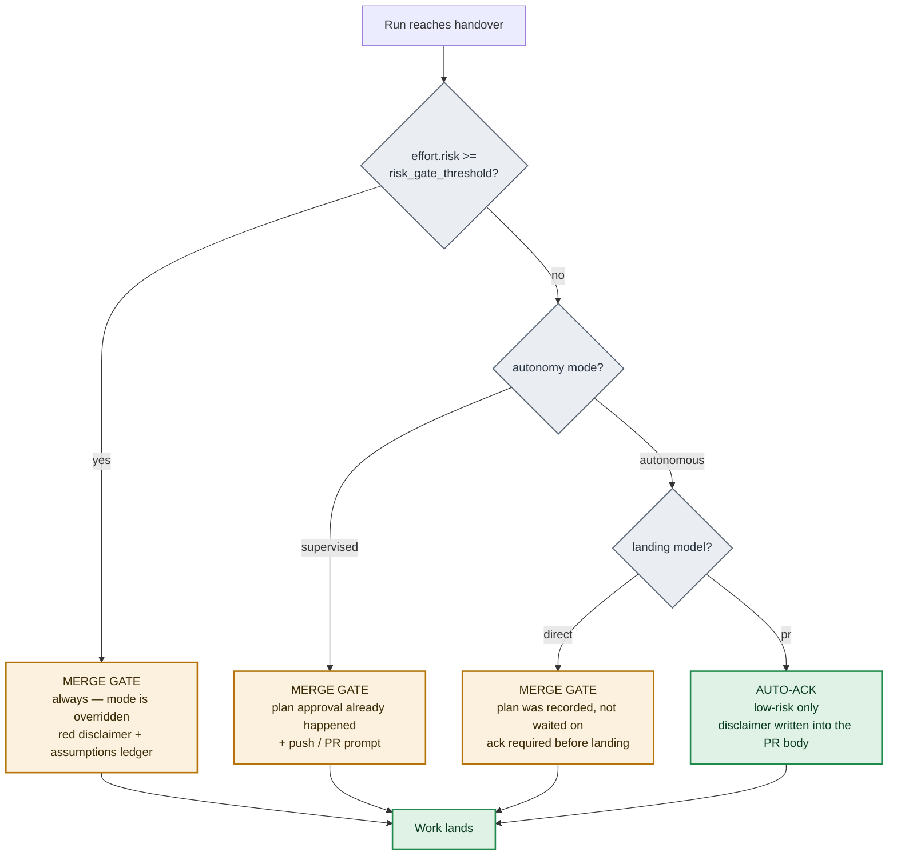

# Architecture

- [Autonomy modes & the merge gate](#autonomy-modes--the-merge-gate)
- [Where the human actually stops](#where-the-human-actually-stops)
- [Interrupt-now gates](#interrupt-now-gates)
- [The fix-loop budget](#the-fix-loop-budget)
- [Where independence actually lives](#where-independence-actually-lives)
- [The review loop](#the-review-loop)
- [Settings reset when the settings model changes](#settings-reset-when-the-settings-model-changes)

For the pipeline diagram, see the [README](../README.md#how-it-works).

## Autonomy modes & the merge gate

auto-task runs in one of two modes, chosen once per project in a **first-run setup** — five questions: telemetry, autonomy, landing style, unattended-external, docs update.

### `supervised` (default)

One human gate at plan approval, plus the push prompt.

### `autonomous`

The procedural gates go silent and the run proceeds unattended. **The merge is the sole mandatory human gate.**

Safety comes from *exception-triggered* interrupts that stop the run only on real trouble — see [Interrupt-now gates](#interrupt-now-gates) below.

High-risk runs (`effort.risk >= risk_gate_threshold`) force the merge gate on regardless of mode, showing a red disclaimer plus an **assumptions ledger** of every call the run made unattended.

## Where the human actually stops

Autonomy mode and landing model combine to decide this. Both are chosen once, at first-run setup.

Read as a table:

| mode | `pr` landing | `direct` landing |
|---|---|---|
| `supervised` *(default)* | plan approval + push/PR prompt | plan approval + prompt before landing |
| `autonomous` | plan recorded; low-risk auto-acks, with a disclaimer in the PR body | plan recorded; **merge-gate ack** before landing |

**Any run with `effort.risk >= risk_gate_threshold` forces the merge gate, regardless of mode.** That is the one path with no auto-ack.

## Interrupt-now gates

These can halt the run during **any** unattended phase, not just Phase 2:

| Gate | Fires when |
|---|---|
| **Ambiguity** | A hard stop for a decision the run can't resolve with evidence |
| **Destructive / out-of-envelope command** | Blocked by `guard-dangerous-ops.sh` unless `unattended_external` is on |
| **Test integrity** | Tests were weakened to reach green |
| **Cost blowout** | A soft check-in when the run is spending far past its estimate |

## The fix-loop budget

Enforced differently from the interrupt gates, and deliberately narrower: **exceeding the effort tier's iteration cap does not abort a phase.** It blocks the *commit* until you acknowledge it, and warns at a turn-end while the loop runs.

This is the mechanism that stops a run churning indefinitely without your say-so.

| Tier | Fix-loop cap | Gate B passes (main loop) |
|---|---|---|
| LIGHT | 2 | 1 |
| STANDARD | 4 | 2 |
| HEAVY | 6 | 3 |

The caps are defined once in `hooks/lib/loop-budget.sh`. The loop count is `max(iteration.fix, iteration.review)`, so **reopening review rounds consume the budget too**. Each of Gate B's four re-gate scopes gets its own flat cap of 2, counted separately — so a spent main loop can never deadlock the handover.

Clearing a block is covered in [Troubleshooting](troubleshooting.md).

## Where independence actually lives

**Read this before assuming a phase is a second opinion.**

Phases 2 and 3 are **skills invoked in the main loop**, so the same model that wrote the code also self-verifies it. That is deliberate — those skills need the run's full context. **A green Phase 3 is still the author checking their own work, and the pipeline does not claim otherwise.**

Independent, fresh-context judgment enters at three points:

| Point | How it's independent |
|---|---|
| **Phase 4** | By default (`review_in_subagent`) the code review is invoked from a fresh-context `general-purpose` agent, so the model that wrote the diff is not the one reviewing it |
| **Gate A** | A `task-execution-verifier` agent, spawned with only the diff, the plan, and the prior-review history — never the parent conversation |
| **Gate B** | Same, in `adversarial` mode |

Phase 4 used to be a self-review and no longer is. It is still the `auto-task-code-review` skill doing the reviewing, pinned by `enforce-gates.sh` via `gates.code_review.tool` — which is what stops a bespoke review prompt being substituted for a disciplined one. The hook reads that field and cannot see the call site, so moving the call site loosens nothing.

**Two caveats on Phase 4's independence,** both stated rather than glossed:

- Setting `review_in_subagent: false` returns it to a self-review.
- Even with it on, a twice-failed spawn — or a reviewer caught editing the tree — falls back to the inline call. The round records `via`, so you can tell which happened.

**All Agent spawns are synchronous** (`run_in_background: false`) so the verifier's report *is* the tool result. A backgrounded spawn returns launch metadata instead, and the run would have nothing to act on.

## The review loop

### Phase 4 — code review

Round 1 reads the full diff; every later round reads only the delta since the previous round. (Delta review applies on the `review_in_subagent: true` path only — that's what keeps the cost near half of a full re-review rather than doubling it.)

**Findings are graded by reachability, not by their severity label.** A finding reopens the loop only if it:

- breaks an approved Acceptance Criterion, **or**
- is a runtime-reachable regression or bypass, **or**
- is a security or data-loss path.

Gate B applies the same test, by reference, so the two cannot drift.

A `blocker` or `required` finding that fails that test is **deferred**, not round-triggering. Once a round comes back with zero reopening findings, the whole deferred set is fixed in ONE batch, followed by a single re-review.

**That batch is spent once per run.** A non-reopening `blocker`/`required` raised after it **parks as a follow-up rather than being fixed** — there is no second batch, and Gate B re-grades it at every tier.

Every round is recorded in `gates.code_review.rounds[]`, and a convergence test on the graded count surfaces with that per-round table instead of looping on.

### Gate B — adversarial

Spawns `task-execution-verifier` in `adversarial` mode at **every tier**, and it is **bounded** by the per-scope pass caps above. Every pass after the first reviews only the delta since the previous one.

A finding reopens Phase 4 only if it meets the same three-part reachability test. Everything else parks, whatever its label.

Gate B surfaces to you in three situations:

1. It hit the cap.
2. A second **self-inflicted** pass — findings that are defects in the previous pass's own fixes.
3. A convergence test fired.

When it surfaces, it offers three grants: **one more pass** · **park and advance** · **descope the residual**.

Once a pass has run, all three triggers are read **only on a pass that reopened something**. A pass that finds nothing to reopen just passes, and never interrupts you. (Reaching the cap before a pass even runs still surfaces.)

## Settings reset when the settings model changes

The settings file is version-stamped, and a release that adds a policy question bumps the stamp.

On the first `/auto-task` after such an update, each project's settings are backed up (`settings.json.pre-<n>`) and cleared, so the one-time setup re-runs and telemetry is re-consented. Your shared **global** settings file is never touched — restore prior values by copying the backup back.

This has happened twice so far: at 0.22 (the autonomy / landing / unattended questions), and again when `docs_update_mode` joined the set.
