# Maintainers

## Releasing (maintainers)

Cutting a release is a dedicated commit, separate from the feature commits it describes.

```mermaid
flowchart LR
    A["1 · Changelog entry<br/>## [X.Y.Z] + lead paragraph"] --> B["2 · Bump version<br/>plugin.json + marketplace.json"]
    B --> C["3 · Regenerate notes<br/>scripts/build-release-notes.sh"]
    C --> D["4 · Verify<br/>tests/release-notes-sync.test.sh"]
    D --> E["5 · Close your fences"]
    E --> F["6 · Commit + annotated tag<br/>chore(release): vX.Y.Z"]

    classDef step fill:#e9edfd,stroke:#3550d6,stroke-width:1.5px,color:#0f1a52;
    classDef check fill:#dcf1f2,stroke:#0d7b83,stroke-width:2px,color:#043033;
    classDef done fill:#e0f2e6,stroke:#1f8a4c,stroke-width:2px,color:#0a3d20;
    class A,B,C,E step;
    class D check;
    class F done;
```



**Order matters: do the version bump *before* step 3** — the generator cross-checks the version it finds in `plugin.json`, so bumping first is what lets it verify the release you are actually shipping.

### 1. Write the changelog entry

Add a `## [X.Y.Z]` section to `CHANGELOG.md`, opening with a one-paragraph lead that describes the release **from the user's point of view**. That paragraph becomes the release note users actually see.

**Markers**, both optional:

| Marker | Effect |
|---|---|
| `<!-- release-notes: skip -->` | Produces **no** note. For a release that changes nothing a user can observe — an internal refactor, dev-only tooling, a docs sync. Unmarked releases are included by default. |
| `<!-- release-notes: your short text -->` | Shows that wording instead of the lead paragraph. |

**Put either marker directly under the `## [X.Y.Z]` heading, above the lead paragraph.** A marker written lower down is treated as an *example* rather than an instruction — otherwise a release that documents this feature would delete its own note — and the generator refuses to write until you move it.

If you do want to *show* the marker inside an entry, put it in a fenced code block or inline code. (An unfenced HTML comment renders as nothing anyway.)

### 2. Bump the version

In `.claude-plugin/plugin.json` **and** `.claude-plugin/marketplace.json`. They must match.

### 3. Regenerate the notes file

```sh
scripts/build-release-notes.sh              # write
scripts/build-release-notes.sh --check      # report staleness without writing
scripts/build-release-notes.sh --stdout     # preview
```

This distills `CHANGELOG.md` into `.claude-plugin/release-notes.json` — the newest 10 releases, each capped at 300 characters — and **must be committed alongside the changelog**.

It **refuses to write** rather than ship a release with no notes, and says which problem it found. The one worth recognising:

> *"the version being shipped … has no note and no skip marker"*

That means the `## [X.Y.Z]` heading for that version is missing or mistyped. It must match exactly — no extra spaces, no leading `v`, three components — or the entry produced no usable text. Fix the heading or the entry; do not work around it.

### 4. Verify

```sh
tests/release-notes-sync.test.sh
```

It fails if the committed `release-notes.json` and a fresh generation disagree — the guard against a changelog entry shipping without its note.

### 5. If your entry contains a fenced code block, close it

**This is the one malformed shape nothing can catch for you.** A fence left unclosed *inside* its own entry, but closed by a later ` ``` `, is balanced overall — so every release heading it spans is swallowed with no diagnostic.

It eats the *older* entries below it rather than yours, so eyeballing the file for your own version would not reveal it.

Nesting is handled correctly — showing a fenced block inside a longer fence works as CommonMark specifies — so this only happens with a genuinely unbalanced fence, which most markdown renderers also render wrongly.

### 6. Commit and tag

Commit as `chore(release): vX.Y.Z`, tag it annotated, then push the commit and the tag.

### Automating this checklist

Steps 1–3 and 6 are exactly what the optional [release step](optional-features.md#release-at-handover-release_mode) does:

1. Point `release_command` at a script that performs steps 2–3 — bump both files, then run `scripts/build-release-notes.sh`.
2. Set `release_mode` to `ask`.

A run will then draft the changelog entry, cut `chore(release): vX.Y.Z`, and tag it — leaving the push to you. Step 4's drift test runs as part of the step's own re-verification.

Step 5 stays yours. An unbalanced fence is the one shape nothing can catch.

> **There is no CI in this repo**, so nothing runs these steps for you. Two things check your work once you run them: the generator refuses to write when the version in `plugin.json` has no note and no `skip` marker (step 3), and the drift test catches a changelog edited without regenerating (step 4). If you edit `CHANGELOG.md` and skip step 3 entirely, the test suite is what tells you.

## Pruning history & worktrees

Per-branch folders under `.auto-task/` never auto-prune during a run.

Reclaim them — and the far larger worktree checkouts — with **`/auto-task-gc`**, which removes reclaimable worktrees and prunes their matching `.auto-task/<branch>/` in one pass. See [Worktree space control](optional-features.md#worktree-space-control-auto-task-gc).

For a `.auto-task/<branch>/` folder that has no worktree, remove it by hand:

```sh
rm -rf .auto-task/<old-branch>/
```

Nothing in the plugin depends on stale folders being present.
