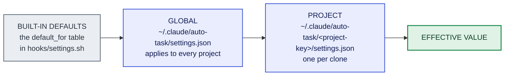

# Settings

Per-project, per-user configuration for the pipeline. **Optional and fully defaulted** — a project with no settings file behaves exactly as it did before this feature existed.

- [How settings resolve](#how-settings-resolve)
- [Managing them](#managing-them)
- **Keys:** [Preview](#preview-verification) · [Bot review](#post-pr-bot-comment-review) · [External actions](#external-actions-phase-8) · [Docs & release](#docs--release-steps) · [Code review](#code-review) · [Visual assets](#visual-assets) · [Telemetry](#telemetry) · [Worktrees](#worktree-retention) · [Misc](#misc)

## How settings resolve



Each layer overrides the one before it — `defaults ⊔ global ⊔ project`, **project wins**. Both files are optional.

That ordering is what lets you set a policy globally and override it *in either direction* per clone. For example, opt into telemetry globally and exclude one sensitive project with `{ "telemetry_enabled": false }` in that project's file.

### Kept OUTSIDE your repo

Settings live at `${AUTO_TASK_HOME:-$HOME/.claude}/auto-task/<project-key>/settings.json`.

The `<project-key>` is derived from the repo's git **common dir** (`git rev-parse --git-common-dir`), which every worktree of one clone shares. So settings are **project-specific and per-clone** — all worktrees resolve to the same file — and a setting **never alters your repo**. Nothing is written in the working tree, and it never appears in `git status`.

### JSON, with fallback

A flat `key: value` object. Any key you omit falls back to its built-in default; the single source of truth is the `default_for` table in `hooks/settings.sh`.

A missing file, malformed JSON, or an absent key all resolve to defaults. The reader is fail-open and never errors a run.

## Managing them

```sh
bash hooks/settings.sh path              # where the project file lives
bash hooks/settings.sh init              # seed a project template
bash hooks/settings.sh init --global     # seed the global one
bash hooks/settings.sh get <key>         # read one merged value
bash hooks/settings.sh all               # read all merged values
bash hooks/settings.sh set <key> <value> # write a project value
```

The orchestrator reads them automatically in Phase 1.

---

# Recognized keys (v1)

## Preview verification

Full behavior: [Optional features → Preview verification](optional-features.md#preview-verification-opt-in--auto-learn).

| Key | Default | Meaning |
|---|---|---|
| `has_preview_deployment` | `false` (unset) | Whether the project has a preview deployment. **Auto-learned when unset** — see the note below. |
| `preview_autodetect` | `true` | Gates auto-learn. Set `false` to disable it entirely. |
| `preview_url` | `""` | Preview URL template, used as a fallback when `gh` finds no deployment. `{branch}` is substituted. |
| `preview_wait_mode` | `"poll"` | `poll` = bounded in-session wait for the deploy. `handoff` = defer the check to a later `/auto-task` resume. |
| `preview_timeout_min` | `30` | Max minutes to wait for the preview before recording `pending`. |
| `preview_poll_interval_sec` | `60` | Seconds between readiness polls. |
| `preview_bypass_header` | `""` | A `Name: value` header for deployment-protection bypass tokens. |
| `preview_post_verdict_comment` | `false` | Post the verdict as a PR comment. An external write, so off by default. |

**On auto-learn.** When `has_preview_deployment` is unset, a post-PR run detects whether a deployment exists and **persists only a positive** (found → `true`, verified every run thereafter). A non-detection is **never** persisted — the setting stays unset and re-learns next run, so a slow or degraded check can never leave a permanent wrong `false`.

Set an explicit `false` to skip detection and stop the per-run re-check. An explicit `true`/`false` is always honored and never overwritten.

With `preview_autodetect: false`, an unset value simply means "no preview" and nothing is persisted.

## Post-PR bot-comment review

Full behavior: [Optional features → Bot-comment review](optional-features.md#post-pr-bot-comment-review-opt-in).

| Key | Default | Meaning |
|---|---|---|
| `bot_review_autofix` | `false` | Collect review-bot comments after the PR opens and conservatively auto-apply the high-confidence, in-scope fixes; park the rest. **Enabling grants write authority to your PR branch.** |
| `bot_review_timeout_min` | `10` | Max minutes to poll for bot comments after the PR opens. |
| `bot_review_poll_interval_sec` | `30` | Seconds between bot-comment polls. |
| `bot_review_bots` | `""` | Extra bot logins to treat as review bots (space- or comma-separated), beyond the built-in list and any `[bot]` / `type:Bot` account. |

Each auto-applied fix goes through the full verify → review → gate → commit → push loop, like any other change.

## External actions (Phase 8)

Full behavior: [Optional features → External change application](optional-features.md#external-change-application-phase-8).

| Key | Default | Meaning |
|---|---|---|
| `external_actions_mode` | `"ask"` | How Phase 8 applies an external-system change. See the modes below. |
| `external_actions_timeout_min` | `30` | Max minutes the in-session **settle-poll** waits for an async change to propagate before surfacing. |
| `external_actions_poll_interval_sec` | `60` | Seconds between settle-poll cycles. |

**Modes:**

| Value | Behavior |
|---|---|
| `ask` *(default)* | Ask once for permission and credentials, then run the change and verify it. Falls back to a runbook if declined. |
| `runbook` | Never auto-run. Always emit a paste-ready runbook and wait. |
| `auto` | Pre-authorized to run without the prompt. Any *irreversible* action still prompts, and unreachable credentials degrade to a runbook. |

This key gates only *how* a change is applied. **Detection and the "not done until applied" marking are always-on**, never gated by a setting.

The timeout applies only to an `auto`-run apply whose effect is asynchronous. A `runbook` or `awaiting-external` human handoff does not poll — it yields and waits for a `/auto-task` resume.

## Docs & release steps

Full behavior: [Docs update](optional-features.md#docs-update-at-handover-docs_update_mode) · [Release step](optional-features.md#release-at-handover-release_mode).

| Key | Default | Meaning |
|---|---|---|
| `docs_update_mode` | `"skip"` | Whether the optional docs-update step runs at handover. Chosen at first-run setup. |
| `release_mode` | `"skip"` | Whether the optional release step (Phase 9) runs. **Local only — never pushes, never publishes.** |
| `release_command` | `""` | Your project's own release command, which the release step runs to write the version bump. |

Both mode keys take `skip` / `always` / `ask`, with the same meanings:

| Value | Behavior |
|---|---|
| `skip` *(default)* | Never run the step, never ask. Exactly the pre-feature behavior. |
| `always` | Run it every run, with no prompt. |
| `ask` | Ask each run — **but only when there is actually something to do**, so a docs-current or nothing-to-release run stays silent. |

Any unrecognized value reads as `skip`.

`docs_update_mode` is scoped to `README.md` and `docs/**` — never `CHANGELOG.md`, `CLAUDE.md`, or code comments.

`release_mode` is deliberately **not** a first-run-setup question. Like `bot_review_autofix`, it's a quiet default-off opt-in you edit in the settings file, because most projects do not want a task runner touching their version numbers, and it shouldn't spend one of the setup prompts or force a settings reset.

**On `release_command`.** It must only **write files** — `scripts/release.sh`, or `npm version minor --no-git-tag-version`. A command that commits and tags by itself (bare `npm version`, `standard-version`, `semantic-release`) breaks the hand-off, because auto-task commits after its own re-gate; the step detects that in its dry-run report and refuses rather than running it.

It's delegated on purpose — only your project knows its full version-file set. **Unset (the default) means the step emits a paste-ready runbook and runs nothing**, rather than guessing a multi-file bump. A delegated command runs under **your** authority and may itself push or publish, so the step tells you what it will do before running it.

## Code review

| Key | Default | Meaning |
|---|---|---|
| `review_in_subagent` | `true` | Where Phase 4's code review runs — a fresh-context agent, or inline. |
| `shadow_review` | `false` | **Measurement only.** Re-reviews the diff once per run to record what a self-review missed. Decides nothing. |

**On `review_in_subagent`.** `true` spawns ONE fresh-context `general-purpose` agent that **invokes the `auto-task-code-review` skill** via the Skill tool, so the model that wrote the diff is not the model that reviews it. `false` invokes the same skill inline in the main loop, restoring the earlier behaviour.

Both modes run the same skill on the same diff and record the same `gates.code_review.tool`, so the commit gate is byte-identical either way — only the reading context changes.

**On the `true` path only**, round 1 reviews the full working-tree diff and every later round only the **delta** since the previous round's recorded boundary (`rounds[n-1].diff_sha`). That is what keeps the cost near half of a full re-review rather than doubling it. `false` reviews the full diff every round.

The agent's prompt forbids edits and forbids writing anything under `.auto-task/` — it reports, the orchestrator fixes. A failed spawn or a malformed report falls back to the inline call after one retry, so the setting can never deadlock a run.

**On `shadow_review`.** When `true`, one fresh-context agent re-reviews the diff once per run, right after Phase 4 goes clean, by invoking the `auto-task-code-review` skill — never a hand-rolled prompt. It sets no gate, reopens no round, and blocks nothing. It records what the self-review missed into `state.shadow_review.missed[]`, each entry graded by Phase 4's own Step-A test, so you can tell a missed AC breach from a missed README nit.

It is **skipped while `review_in_subagent` is on**, which is the default — with the review already independent there's no self-review left to measure. The skip is recorded as a status rather than omitted. It exists for the `review_in_subagent: false` configuration, where Phases 2–4 all run in the main loop.

Cost: roughly one Gate-A-sized pass (~24k output tokens) per run, while it actually runs.

## Visual assets

Full behavior: [Optional features → Visual PR proof](optional-features.md#visual-pr-proof-opt-in).

| Key | Default | Meaning |
|---|---|---|
| `visual_assets_enabled` | `false` | Embed before/after screenshots in PRs for visual changes. `/auto-task` asks once per repo, on UI-scoped runs. |
| `cloudinary_cloud_name` | *(bundled)* | Cloudinary cloud that uploads go to. Not a secret — it's in every delivery URL. |
| `cloudinary_upload_preset` | *(bundled)* | The **unsigned** upload preset. Not a secret. |

With `visual_assets_enabled: false`, verification still runs locally; the PR just gets a local-artifact and preview note instead of embedded images.

Both Cloudinary keys default to a **bundled shared** disposable account, so opt-in embedding works out of the box. Override with your own values, or via `AUTO_TASK_CLOUDINARY_DEFAULT_CLOUD` / `AUTO_TASK_CLOUDINARY_DEFAULT_PRESET`.

If you self-host: an unsigned preset is **world-writable**, so restrict your own — allowed formats and size, a fixed folder, moderation.

## Telemetry

Full behavior: [Telemetry & metrics](telemetry.md).

| Key | Default | Meaning |
|---|---|---|
| `telemetry_enabled` | `false` | Opt-in for **remote** anonymous telemetry. |
| `telemetry_endpoint` | *(bundled)* | HTTPS ingest URL the anonymized row is POSTed to. Must be `https://…` — a non-https or empty value sends nothing. |
| `telemetry_ingest_token` | *(bundled)* | Bearer token sent as `Authorization: Bearer …`. Clear it to send no auth header. |
| `telemetry_satisfaction_prompt` | `true` | When telemetry is on, whether Phase 5 asks a satisfaction question at the push prompt. |

The endpoint defaults to the bundled central collector, shipped in `hooks/settings.sh`; override either key to self-host.

The bundled ingest token is a **PUBLIC, write-only key — not a secret.** It is world-readable by design, and a leak only permits appending junk rows.

## Worktree retention

Full behavior: [Optional features → Worktree space control](optional-features.md#worktree-space-control-auto-task-gc).

| Key | Default | Meaning |
|---|---|---|
| `worktree_cleanup_nudge` | `true` | Whether the SessionStart hook nudges you when reclaimable worktrees accumulate. Non-destructive. |
| `worktree_cleanup_throttle_hours` | `24` | Minimum hours between cleanup nudges, **per clone**. |
| `worktree_cleanup_prune_dirty` | `false` | Whether `/auto-task-gc --prune --yes` may reclaim a **dirty** worktree, by WIP-committing its uncommitted work first. Off by default: dirty worktrees are kept. |

**Stale thresholds** — days a *clean, unmerged* worktree must be untouched (by last-commit date) before it counts as reclaimable. Retention is per branch type, so short-lived work is reclaimed sooner:

| Key | Default | Applies to |
|---|---|---|
| `worktree_stale_days_feat` / `_refactor` | `30` | `feat/`, `refactor/` — longer-lived work |
| `worktree_stale_days_fix` | `14` | `fix/` |
| `worktree_stale_days_chore` / `_deps` / `_docs` / `_cleanup` | `7` | Short-lived `chore/`, `deps/`, `docs/`, `cleanup/` |
| `worktree_stale_days_default` | `14` | Fallback for any type without its own key |

## Misc

| Key | Default | Meaning |
|---|---|---|
| `history_reminder_enabled` | `false` | Opt-in `UserPromptSubmit` hook that tells non-bundled tools an `.auto-task/<branch>/` history folder exists for the current branch. Wired in every install but OFF by default. Emits nothing outside auto-task branches. |
