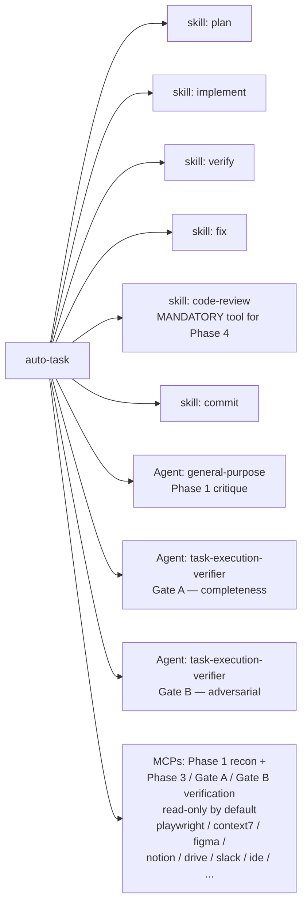

# auto-task — Architecture

End-to-end autonomous task pipeline. One human gate at plan approval; everything after runs unattended until success, a hard blocker, or test flakiness.

This document is a map of the moving parts: the pipeline phases, the artifacts on disk, the related skills/agents the pipeline composes, and the global settings (CLAUDE.md rules + pre-commit hook) that enforce its invariants.

---

## Pipeline diagram

```mermaid
flowchart TD
    Start([/auto-task &lt;description&gt;]) --> P1Setup[Phase 1 — Branch setup<br/>git switch -c feat|fix|chore/&lt;slug&gt;<br/>append .patches/ to .git/info/exclude<br/>init AUTO-TASK-STATE.json]
    P1Setup --> Recon{Recon trigger?<br/>UI / runtime / external lib /<br/>Figma / Notion / etc.}
    Recon -- yes --> ReconDo[MCP recon, read-only<br/>any MCP if necessary<br/>playwright / context7 / figma /<br/>notion / drive / slack / ide / ...]
    Recon -- no --> P1Plan
    ReconDo --> P1Plan[Invoke skill: plan<br/>append Acceptance Criteria table<br/>append Effort: D + R + tier<br/>spawn critique Agent]
    P1Plan --> Preflight[AC pre-flight<br/>dry-run every AC command<br/>pin baselines<br/>sample-verify external-tool lists<br/>FP &gt; 20%? STOP and surface]
    Preflight --> Gate1{{HUMAN GATE<br/>user types: approved / proceed / yes}}
    Gate1 -- approved --> P2[Phase 2 — Execute<br/>skill: implement<br/>drift check at each checkpoint<br/>NO COMMIT]
    Gate1 -- rejected --> StopUser([stop / wait])

    P2 --> P3[Phase 3 — Self-verify<br/>skill: verify on uncommitted diff<br/>run every Gate=self-verify AC row<br/>MCPs allowed, read-only<br/>NO COMMIT]
    P3 --> P3OK{verify pass<br/>+ all self-verify AC pass?}
    P3OK -- no --> P3Fix[skill: fix<br/>iteration.fix++<br/>re-score effort if drift<br/>Loop rule check]
    P3Fix --> P3
    P3OK -- yes --> GateA[Gate A — Independent verifier<br/>run every Gate=gate-a AC row<br/>spawn task-execution-verifier<br/>fresh context: diff + AC table<br/>NO COMMIT]

    GateA --> GateAOK{all AC satisfied?}
    GateAOK -- no --> GateAFix[Append findings as new tasks<br/>→ back to Phase 2]
    GateAFix --> P2
    GateAOK -- yes --> P4
    GateA -.- ACGate[MCPs allowed for AC<br/>bound-check execution<br/>read-only][Phase 4 — Code review loop<br/>skill: code-review on working-tree diff<br/>parse Blockers / Required / Follow-ups<br/>NO COMMIT]

    P4 --> P4Cls{findings?}
    P4Cls -- only follow-ups --> P4OK[park follow-ups in state<br/>set gates.code_review.passed=true<br/>tool='skill:code-review'<br/>clean_pass_after_last_fix=true]
    P4Cls -- blocker / required --> P4Fix[skill: fix<br/>re-run skill: verify<br/>iteration.review++<br/>clean_pass_after_last_fix=false]
    P4Fix --> P4

    P4OK --> Tier{tier?}
    Tier -- LIGHT --> SkipB[gates.gate_b.skipped_reason='tier=light']
    Tier -- STANDARD/HEAVY --> GateB[Gate B — Adversarial verifier<br/>spawn task-execution-verifier<br/>fresh context: AC + full diff + Phase-4 findings<br/>prompt flipped to 'find what's wrong'<br/>NO COMMIT]

    GateB --> GateBCls{severity?}
    GateBCls -- blocker / required --> GateBFix[reset code_review.passed=false<br/>→ back to Phase 4]
    GateBFix --> P4
    GateBCls -- only follow-up / none --> GateBOK[gates.gate_b.passed=true]

    SkipB --> P5
    GateBOK --> P5[Phase 5 — Handover<br/>SINGLE COMMIT phase]

    P5 --> P5Verify{verify gates:<br/>code_review.passed AND<br/>(gate_b.passed OR skipped_reason)}
    P5Verify -- missing --> StopBug([STOP — pipeline bug,<br/>do NOT bypass hook])
    P5Verify -- ok --> P5Stage[git restore --staged .patches/<br/>git add &lt;planned files only&gt;<br/>confirm no .patches/ in index]
    P5Stage --> P5Commit[skill: commit<br/>pre-commit hook validates gates]
    P5Commit --> P5Push{push?<br/>only allowed prompt mid-run}
    P5Push -- yes --> P5PR[git push -u origin HEAD<br/>gh pr create]
    P5Push -- hold --> Done2([phase=done, no PR])
    P5PR --> Done([phase=done, pr_url recorded])

    %% Loop-rule global exits
    P3 -. no progress / out-of-scope /<br/>blocker / flakiness .-> Surface([Surfacing protocol<br/>save state, write status, wait])
    P4 -. no progress / out-of-scope /<br/>blocker / flakiness .-> Surface
    P2 -. drift outside plan intent .-> Surface
```

---

## Phases at a glance

| Phase | Tool used | Commits? | Exit condition | Failure routing |
|---|---|---|---|---|
| 1 Define | `plan` skill + critique Agent | no | user types approval keyword | wait (or reject → stop) |
| 2 Execute | `implement` skill | **no** | all PLAN.md tasks ticked | drift check escalates tier or stops |
| 3 Self-verify | `verify` skill + literal AC commands | **no** | all checks pass + every `self-verify` AC pass | `fix` skill → loop, capped by tier |
| Gate A | `task-execution-verifier` Agent + literal AC commands | **no** | every AC satisfied | findings → back to Phase 2 |
| 4 Code review | **`code-review` skill** (no substitutes) | **no** | only follow-ups, no Blockers/Required | `fix` → re-`verify` → re-review |
| Gate B | `task-execution-verifier` Agent (adversarial) | **no** | "No adversarial findings" or only follow-ups | resets `code_review.passed=false`, back to Phase 4 |
| 5 Handover | `commit` skill + `gh pr create` | **YES — single commit** | PR opened (or user holds push) | gates fail → surface (do not bypass hook) |

Only **Phase 5** commits. Phases 2–4 accumulate one growing uncommitted diff against the base branch.

---

## Effort tiers

Difficulty (D) and Risk (R) each scored 0–8 in Phase 1. Tier = `max(D, R)`.

| Tier | Range | `/verify` scope | Fix-loop cap | Gate B |
|---|---|---|---|---|
| LIGHT | 0–2 | types + unit | 2 | skipped (`gate_b.skipped_reason='tier=light'`) |
| STANDARD | 3–5 | types + unit + lint | 4 | run |
| HEAVY | 6–8 | types + unit + lint + build (+ e2e if touched) | 6 | run, with cross-check pass |

Tier can only **escalate** — never auto-de-escalate. Every change is logged to `effort.history` with `{from, to, reason, at}`. Re-score hooks fire on drift (Phase 2 checkpoints) and on fix-cap exhaustion (Phase 3, Phase 4).

---

## State file — `.patches/AUTO-TASK-STATE.json`

The pipeline is fully resumable. State is updated at every phase transition and every loop iteration.

```json
{
  "phase": "define|execute|self-verify|gate-a|review|gate-b|handover|done",
  "approved": true,
  "description": "<verbatim task input>",
  "branch": "<resolved branch name>",
  "effort": {
    "tier": "light|standard|heavy",
    "difficulty": 0,
    "risk": 0,
    "history": [{ "from": "...", "to": "...", "reason": "...", "at": "ISO-8601" }]
  },
  "iteration": { "review": 0, "fix": 0 },
  "history": [{ "phase": "...", "result": "...", "summary": "...", "at": "ISO-8601" }],
  "gates": {
    "self_verify": { "passed": false, "at": null, "evidence": null },
    "gate_a":      { "passed": false, "at": null, "evidence": null },
    "code_review": { "passed": false, "tool": null, "clean_pass_after_last_fix": false, "at": null, "evidence": null },
    "gate_b":      { "passed": false, "at": null, "evidence": null, "skipped_reason": null }
  },
  "followups": [{ "source": "code-review", "note": "...", "at": "ISO-8601" }],
  "pr_url": null
}
```

`.patches/` is **never committed**. It is added to `.git/info/exclude` (per-clone, never to the repo's `.gitignore`) and pre-stage-cleaned before every commit.

### `.patches/` layout during a run

```
.patches/
├── AUTO-TASK-STATE.json   # state machine (see above)
├── PLAN.md                # plan + Critique + Acceptance Criteria + Effort
└── recon/                 # (optional) Playwright screenshots from Phase 1
```

---

## Acceptance Criteria contract

Phase 1 cannot complete without an `## Acceptance Criteria` table in `.patches/PLAN.md`. Every row must be:

1. **Observable** — third-party-witnessable outcome, not "auth works correctly".
2. **Bound to a check** — concrete command/assertion/observation, not "manually check".
3. **Falsifiable** — comparable expected value (exit code, status, selector absent), not "no problems".
4. **Gate-bound** — `self-verify` | `gate-a` | `gate-b`.
5. **Complete** — covers every behavior the task description promises.

`gates.self_verify.passed` cannot be set unless **every** `self-verify`-gated AC has a recorded pass from the current iteration. Same for `gate_a`. There is no escape hatch.

---

## Composed skills and agents



- **`plan`** — produces the implementation plan. Auto-task appends Acceptance Criteria + Effort + Critique.
- **`implement`** — ticks off plan tasks; auto-task interprets each `<!-- COMMIT CHECKPOINT -->` as a **drift-check** marker (not a commit marker).
- **`verify`** — runs types/lint/build/tests; auto-task also runs literal AC commands on top.
- **`fix`** — invoked on any failure; modifies the working tree, never commits during a run.
- **`code-review`** — 5-phase Investigate → Define → Execute → Prevent → Verify. **Hard-required** in Phase 4. Agents/hand-rolled prompts are forbidden and the pre-commit hook rejects any other `gates.code_review.tool` value.
- **`commit`** — used in Phase 5 only; pre-commit hook validates gates first.
- **`task-execution-verifier`** — spawned twice. Gate A asks "is this complete?"; Gate B flips to "find what's wrong" (adversarial). Both get fresh context (diff + AC only — no conversation history).

---

## Global rules referenced from `~/.claude/CLAUDE.md`

These rules are enforced project-wide and the pipeline depends on them:

- **Commit messages — no AI-attribution markers.** No `Co-Authored-By: Claude`, no `🤖 Generated with [Claude Code]`. Enforced both by the skill's Phase 5 instructions and by a global `PreToolUse` Bash hook that blocks any `git commit -m`/`gh pr create --body` containing those strings.
- **Code review — always the skill.** Never a `code-reviewer` agent or a hand-rolled review prompt. Re-invoke after every fix. Mirrored by the pre-commit hook check on `gates.code_review.tool === "skill:code-review"`.
- **Mid-protocol non-yielding.** A sub-skill/sub-agent report is **input** to the next step, not an end-of-turn. The only legitimate stops between Phase 1 approval and Phase 5 are: a Loop-rule trigger, the one Phase 5 push prompt, or a destructive-action confirmation per "Executing actions with care".
- **Task Execution Protocol — Define → Execute → Verify.** Mirrored 1:1 by auto-task's phase structure.

---

## Global settings — `~/.claude/settings.json`

Two `PreToolUse` Bash hooks back the contract:

### Hook 1 — block AI-attribution in commit messages

```text
matcher: Bash
trigger: any command containing
  Co-Authored-By: Claude
  | Generated with [Claude Code]
  | 🤖 Generated
action: exit 2 with explanation pointing at ~/.claude/CLAUDE.md
```

### Hook 2 — enforce gates on `git commit`

Runs only when:
- the command is a `git commit` (regex-matched at line/pipe boundaries),
- `.patches/AUTO-TASK-STATE.json` exists,
- `approved === true`,
- `phase !== "done"`.

Then it reads the state file and **blocks the commit** unless ALL of:

| State field | Required value |
|---|---|
| `gates.code_review.passed` | `true` |
| `gates.code_review.tool` | `"skill:code-review"` (literal — agents/hand-rolled prompts rejected) |
| `gates.code_review.clean_pass_after_last_fix` | `true` |
| `gates.gate_b.passed` OR `gates.gate_b.skipped_reason` | one of them set, unless `tier === "light"` |

The hook is the single point of mechanical enforcement that makes the **single-commit rule** real. Bypassing it (e.g., `--no-verify`) is forbidden by global rules.

### Other relevant settings (excerpt)

```json
{
  "permissions": {
    "deny":  ["Bash(git push:*)", "Bash(git push)"],
    "ask":   ["Bash(gh pr create:*)", "Bash(gh pr merge:*)", ...],
    "defaultMode": "bypassPermissions"
  }
}
```

- `git push` is in **deny** — Phase 5's push is therefore an explicit user-confirmed action.
- `gh pr create` is in **ask** — PR creation always surfaces a permission prompt, which doubles as the Phase 5 "push/PR/hold" gate.

---

## Surfacing protocol (Loop-rule trigger)

When ANY of these is true mid-pipeline, the run stops and waits:

1. **No progress** — two consecutive iterations with no measurable improvement.
2. **Out-of-scope** — remaining issues don't map to approved Acceptance Criteria.
3. **External blocker** — missing creds, broken infra, undecided design, third-party outage.
4. **Test flakiness** — non-deterministic failure (passes on retry without code change).

State is saved. The user gets a short status message: **why stopped** + **what's done / pending / failing** + **suggested next move**. Do not auto-resume — wait for the user. Resume with `/auto-task` (no args).

---

## Invariants (the contract)

- **Single commit.** Only Phase 5 commits — guaranteed by the pre-commit hook + the skill's per-phase "NO COMMIT" rule.
- **`.patches/` never committed.** Excluded via `.git/info/exclude`, pre-stage-cleaned at every commit. A leaked commit means a bug — surface, do not silently rewrite history.
- **One human gate** between approval and PR. Plus one allowed prompt in Phase 5 (push/PR/hold).
- **Acceptance Criteria are load-bearing.** No gate can pass without literal execution of its bound AC rows.
- **Effort can only escalate.** Manual de-escalation requires editing `Effort:` in `.patches/PLAN.md`.
- **Fresh-context agents.** Both `task-execution-verifier` spawns receive only `{ diff, AC }` — never conversation history.
- **Pre-existing user work is preserved.** Pre-staged files at run start are recorded as baseline and excluded from every auto-task commit.

---

## Related files

| Path | Role |
|---|---|
| `~/.claude/skills/auto-task/SKILL.md` | The skill spec (source of truth) |
| `~/.claude/skills/plan/SKILL.md` | Composed by Phase 1 |
| `~/.claude/skills/implement/SKILL.md` | Composed by Phase 2 |
| `~/.claude/skills/verify/SKILL.md` | Composed by Phase 3 |
| `~/.claude/skills/fix/SKILL.md` | Composed by Phases 3, 4, Gate A, Gate B |
| `~/.claude/skills/code-review/SKILL.md` | **Mandatory** tool for Phase 4 |
| `~/.claude/skills/commit/SKILL.md` | Composed by Phase 5 |
| `~/.claude/CLAUDE.md` | Global rules: commit-message ban, code-review-skill rule, non-yielding, DoD |
| `~/.claude/settings.json` | Pre-commit hooks (gate enforcement + AI-attribution ban), `git push` deny, `gh pr create` ask |
| `<project>/.patches/AUTO-TASK-STATE.json` | Per-run state machine (resumable) |
| `<project>/.patches/PLAN.md` | Per-run plan + AC + Effort + Critique |
| `<project>/.git/info/exclude` | Per-clone `.patches/` exclusion (never modifies repo `.gitignore`) |
