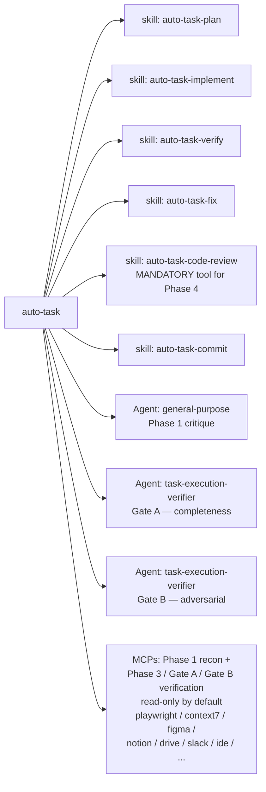

# auto-task — Architecture

End-to-end autonomous task pipeline. One human gate at plan approval; everything after runs unattended until success, a hard blocker, or test flakiness.

This document is a map of the moving parts: the pipeline phases, the artifacts on disk, the related skills/agents the pipeline composes, and the global settings (CLAUDE.md rules + pre-commit hook) that enforce its invariants.

---

## Pipeline diagram

```mermaid
flowchart TD
    Start([/auto-task &lt;description&gt;]) --> P1Setup[Phase 1 — Branch setup<br/>every run: fork feat|fix|chore/&lt;slug&gt; from fresh default branch<br/>git worktree add + EnterWorktree; fallback git switch -c<br/>already inside a worktree → run in place<br/>append .auto-task/ to git-common-dir/info/exclude<br/>init .auto-task/&lt;branch&gt;/STATE.json]
    P1Setup --> Recon{Recon trigger?<br/>UI / runtime / external lib /<br/>Figma / Notion / etc.}
    Recon -- yes --> ReconDo[MCP recon, read-only<br/>any MCP if necessary<br/>playwright / context7 / figma /<br/>notion / drive / slack / ide / ...]
    Recon -- no --> Approach
    ReconDo --> Approach{Multiple viable<br/>approaches?}
    Approach -- yes --> ApproachDo[Approach selection<br/>2-3 short candidate sketches<br/>inline or parallel agents by complexity<br/>score + select<br/>close-call/high-stakes → AskUserQuestion<br/>write PLAN.md ## Approach decision log]
    Approach -- no, single approach --> P1Plan
    ApproachDo --> P1Plan[Invoke skill: auto-task-plan<br/>break down chosen approach only<br/>append Acceptance Criteria table<br/>append Effort: D + R + tier<br/>critique Agent → re-plan loop<br/>auto-fix structural findings, cap by tier]
    P1Plan --> Preflight[AC pre-flight<br/>dry-run every AC command<br/>pin baselines<br/>sample-verify external-tool lists<br/>FP &gt; 20%? STOP and surface]
    Preflight --> Gate1{{HUMAN GATE<br/>user types: approved / proceed / yes}}
    Gate1 -- approved --> P2[Phase 2 — Execute<br/>skill: auto-task-implement<br/>drift check at each checkpoint<br/>NO COMMIT]
    Gate1 -- rejected --> StopUser([stop / wait])

    P2 --> P3[Phase 3 — Self-verify<br/>skill: auto-task-verify on uncommitted diff<br/>run every Gate=self-verify AC row<br/>MCPs allowed, read-only<br/>NO COMMIT]
    P3 --> P3OK{verify pass<br/>+ all self-verify AC pass?}
    P3OK -- no --> P3Fix[skill: auto-task-fix<br/>iteration.fix++<br/>re-score effort if drift<br/>Loop rule check]
    P3Fix --> P3
    P3OK -- yes --> GateA[Gate A — Independent verifier<br/>run every Gate=gate-a AC row<br/>spawn task-execution-verifier<br/>fresh context: diff + AC table<br/>NO COMMIT]

    GateA --> GateAOK{all AC satisfied?}
    GateAOK -- no --> GateAFix[Append findings as new tasks<br/>→ back to Phase 2]
    GateAFix --> P2
    GateAOK -- yes --> P4
    GateA -.- ACGate[MCPs allowed for AC<br/>bound-check execution<br/>read-only][Phase 4 — Code review loop<br/>skill: auto-task-code-review on working-tree diff<br/>parse Blockers / Required / Follow-ups<br/>NO COMMIT]

    P4 --> P4Cls{findings?}
    P4Cls -- only follow-ups --> P4OK[park follow-ups in state<br/>set gates.code_review.passed=true<br/>tool='skill:auto-task-code-review'<br/>clean_pass_after_last_fix=true]
    P4Cls -- blocker / required --> P4Fix[skill: auto-task-fix<br/>re-run skill: auto-task-verify<br/>iteration.review++<br/>clean_pass_after_last_fix=false]
    P4Fix --> P4

    P4OK --> Tier{tier?}
    Tier -- LIGHT --> SkipB[gates.gate_b.skipped_reason='tier=light']
    Tier -- STANDARD/HEAVY --> GateB[Gate B — Adversarial verifier<br/>spawn task-execution-verifier<br/>fresh context: AC + full diff + Phase-4 findings<br/>prompt flipped to 'find what's wrong'<br/>NO COMMIT]

    GateB --> GateBCls{severity?}
    GateBCls -- blocker / required --> GateBFix[reset code_review.passed=false<br/>→ back to Phase 4]
    GateBFix --> P4
    GateBCls -- only follow-up / none --> GateBOK[gates.gate_b.passed=true]

    SkipB --> P5
    GateBOK --> P5[Phase 5 — Handover<br/>SINGLE COMMIT phase]

    P5 --> P5Verify{verify gates:<br/>code_review.passed AND<br/>(gate_b.passed OR skipped_reason)}
    P5Verify -- missing --> StopBug([STOP — pipeline bug,<br/>do NOT bypass hook])
    P5Verify -- ok --> P5Stage[git restore --staged .auto-task/<br/>git add &lt;planned files only&gt;<br/>confirm no .auto-task/ in index]
    P5Stage --> P5Commit[skill: auto-task-commit<br/>pre-commit hook validates gates]
    P5Commit --> P5Push{push?<br/>only allowed prompt mid-run}
    P5Push -- yes --> P5PR[git push -u origin HEAD<br/>gh pr create]
    P5Push -- hold --> Done2([phase=done, no PR])
    P5PR --> Done([phase=done, pr_url recorded])

    %% Loop-rule global exits
    P3 -. no progress / out-of-scope /<br/>blocker / flakiness .-> Surface([Surfacing protocol<br/>save state, write status, wait])
    P4 -. no progress / out-of-scope /<br/>blocker / flakiness .-> Surface
    P2 -. drift outside plan intent .-> Surface
```

---

On a NEW run, before branch setup, Phase 1 also runs a best-effort **per-run version check** (`check-version.sh --plain`, throttle bypassed, bounded, fail-open) and asks once if a newer plugin version is published — separate from, and not affecting, the cached SessionStart update notice (the per-run check never writes the SessionStart throttle stamp). Skipped on resume.

## Phases at a glance

| Phase | Tool used | Commits? | Exit condition | Failure routing |
|---|---|---|---|---|
| 1 Define | approach selection + `auto-task-plan` skill + critique→re-plan loop | no | user types approval keyword | wait (or reject → stop) |
| 2 Execute | `auto-task-implement` skill | **no** | all PLAN.md tasks ticked | drift check escalates tier or stops |
| 3 Self-verify | `auto-task-verify` skill + literal AC commands | **no** | all checks pass + every `self-verify` AC pass | `auto-task-fix` skill → loop, capped by tier |
| Gate A | `task-execution-verifier` Agent + literal AC commands | **no** | every AC satisfied | findings → back to Phase 2 |
| 4 Code review | **`auto-task-code-review` skill** (no substitutes) | **no** | only follow-ups, no Blockers/Required | `auto-task-fix` → re-`auto-task-verify` → re-review |
| Gate B | `task-execution-verifier` Agent (adversarial) | **no** | "No adversarial findings" or only follow-ups | resets `code_review.passed=false`, back to Phase 4 |
| 5 Handover | `auto-task-commit` skill + `gh pr create` | **YES — single commit** | PR opened (or user holds push) | gates fail → surface (do not bypass hook) |

Only **Phase 5** commits. Phases 2–4 accumulate one growing uncommitted diff against the base branch.

---

## Effort tiers

Difficulty (D) and Risk (R) each scored 0–8 in Phase 1. Tier = `max(D, R)`.

| Tier | Range | `/auto-task-verify` scope | Fix-loop cap | Gate B |
|---|---|---|---|---|
| LIGHT | 0–2 | types + unit | 2 | skipped (`gate_b.skipped_reason='tier=light'`) |
| STANDARD | 3–5 | types + unit + lint | 4 | run |
| HEAVY | 6–8 | types + unit + lint + build (+ e2e if touched) | 6 | run, with cross-check pass |

Tier can only **escalate** — never auto-de-escalate. Every change is logged to `effort.history` with `{from, to, reason, at}`. Re-score hooks fire on drift (Phase 2 checkpoints) and on fix-cap exhaustion (Phase 3, Phase 4).

---

## State file — `.auto-task/<branch>/STATE.json`

The pipeline is fully resumable. State is updated at every phase transition and every loop iteration. `<branch>` mirrors `git branch --show-current` verbatim (slashes preserved), so the gate and Stop hooks resolve the same path.

```json
{
  "phase": "define|execute|self-verify|gate-a|review|gate-b|handover|done",
  "expected_next_action": "auto-continue|user-approval|user-push-prompt|null",
  "approved": true,
  "description": "<verbatim task input>",
  "branch": "<resolved branch name>",
  "base": "<base-commit SHA the run's diff is measured against>",
  "effort": {
    "tier": "light|standard|heavy",
    "difficulty": 0,
    "risk": 0,
    "history": [{ "from": "...", "to": "...", "reason": "...", "at": "ISO-8601" }]
  },
  "iteration": { "review": 0, "fix": 0 },
  "history": [{ "phase": "...", "result": "...", "summary": "...", "at": "ISO-8601" }],
  "gates": {
    "self_verify": { "passed": false, "at": null, "evidence": null },
    "gate_a":      { "passed": false, "at": null, "evidence": null },
    "code_review": { "passed": false, "tool": null, "clean_pass_after_last_fix": false, "reviewed_diff_sha": null, "at": null, "evidence": null },
    "gate_b":      { "passed": false, "at": null, "evidence": null, "skipped_reason": null }
  },
  "followups": [{ "source": "code-review", "note": "...", "at": "ISO-8601" }],
  "pr_url": null
}
```

`.auto-task/` is **never committed**. Its root is added to the common-dir exclude (`$(git rev-parse --git-common-dir)/info/exclude` — that is `.git/info/exclude` in a normal checkout and the shared common dir from any linked worktree; per-clone, never to the repo's `.gitignore`) and pre-stage-cleaned before every commit.

### `.auto-task/<branch>/` layout during a run

```
.auto-task/
└── <branch>/                 # branch path preserved verbatim (fix/foo → .auto-task/fix/foo/)
    ├── STATE.json            # state machine (see above)
    ├── PLAN.md               # plan + Approach + Critique + Acceptance Criteria + Pre-flight + Recon
    ├── CONTEXT.md            # Phase 5 handover artifact (regenerated each Phase 5)
    ├── TRACE.md              # append-only operation log
    ├── recon/                # Phase 1 reconnaissance + change-diagram.mmd
    ├── fixes/                # per-fix patch notes (auto-task-fix lessons)
    └── artifacts/            # proofs of completion (tests, screenshots, diffs, logs)
```

---

## Acceptance Criteria contract

Phase 1 cannot complete without an `## Acceptance Criteria` table in `.auto-task/<branch>/PLAN.md`. Every row must be:

1. **Observable** — third-party-witnessable outcome, not "auth works correctly".
2. **Bound to a check** — concrete command/assertion/observation, not "manually check".
3. **Falsifiable** — comparable expected value (exit code, status, selector absent), not "no problems".
4. **Gate-bound** — `self-verify` | `gate-a` | `gate-b`.
5. **Complete** — covers every behavior the task description promises.

`gates.self_verify.passed` cannot be set unless **every** `self-verify`-gated AC has a recorded pass from the current iteration. Same for `gate_a`. There is no escape hatch.

---

## Composed skills and agents



- **`auto-task-plan`** — produces the implementation plan for the chosen approach. Auto-task runs approach selection first (2–3 candidate sketches scored and selected, close calls folded into the human gate), then appends Acceptance Criteria + Effort + Critique. The critique runs as a bounded re-plan loop: structural-fixable findings are auto-amended and re-critiqued (cap by tier); only judgment-required findings reach the human.
- **`auto-task-implement`** — ticks off plan tasks; auto-task interprets each `<!-- DRIFT CHECKPOINT -->` as a **drift-check** marker (not a commit marker).
- **`auto-task-verify`** — runs types/lint/build/tests; auto-task also runs literal AC commands on top.
- **`auto-task-fix`** — invoked on any failure; modifies the working tree, never commits during a run.
- **`auto-task-code-review`** — 5-phase Investigate → Define → Execute → Prevent → Verify. **Hard-required** in Phase 4. Agents/hand-rolled prompts are forbidden and the pre-commit hook rejects any other `gates.code_review.tool` value.
- **`auto-task-commit`** — used in Phase 5 only; pre-commit hook validates gates first.
- **`task-execution-verifier`** — spawned twice. Gate A asks "is this complete?"; Gate B flips to "find what's wrong" (adversarial). Both get fresh context (diff + AC only — no conversation history).

---

## Global rules referenced from `~/.claude/CLAUDE.md`

These rules are enforced project-wide and the pipeline depends on them:

- **Commit messages — no AI-attribution markers.** No `Co-Authored-By: Claude`, no `🤖 Generated with [Claude Code]`. Enforced both by the skill's Phase 5 instructions and by a global `PreToolUse` Bash hook that blocks any `git commit -m`/`gh pr create --body` containing those strings.
- **Code review — always the skill.** Never a `code-reviewer` agent or a hand-rolled review prompt. Re-invoke after every fix. Mirrored by the pre-commit hook check on `gates.code_review.tool === "skill:auto-task-code-review"`.
- **Mid-protocol non-yielding.** A sub-skill/sub-agent report is **input** to the next step, not an end-of-turn. The only legitimate stops between Phase 1 approval and Phase 5 are: a Loop-rule trigger, the one Phase 5 push prompt, or a destructive-action confirmation per "Executing actions with care".
- **Task Execution Protocol — Define → Execute → Verify.** Mirrored 1:1 by auto-task's phase structure.

---

## Global settings — `~/.claude/settings.json`

Three `PreToolUse` Bash hooks back the contract:

### Hook 1 — block AI-attribution in commit messages

```text
matcher: Bash
trigger: any command containing
  Co-Authored-By: Claude
  | Generated with [Claude Code]
  | 🤖 Generated
action: exit 2 with explanation pointing at ~/.claude/CLAUDE.md
```

### Hook 2 — enforce gates on `git commit`

Runs only when:
- the command is a `git commit` (regex-matched at line/pipe boundaries),
- `.auto-task/<branch>/STATE.json` exists (branch from `git branch --show-current`),
- `approved === true`,
- `phase !== "done"`.

Then it reads the state file and **blocks the commit** unless ALL of:

| State field | Required value |
|---|---|
| `gates.code_review.passed` | `true` |
| `gates.code_review.tool` | `"skill:auto-task-code-review"` (literal — agents/hand-rolled prompts rejected) |
| `gates.code_review.clean_pass_after_last_fix` | `true` |
| `gates.code_review.reviewed_diff_sha` | must equal `git diff <pinned-flags> <base> \| git hash-object --stdin` recomputed at commit time, where `<pinned-flags>` = `--no-color --no-ext-diff --no-textconv --no-renames --diff-algorithm=myers --src-prefix=a/ --dst-prefix=b/` (skipped if `base`/`reviewed_diff_sha` absent) |
| `gates.gate_b.passed` OR `gates.gate_b.skipped_reason` | one of them set, unless `tier === "light"` |

The first four bind to a single code-review pass; the `reviewed_diff_sha` row additionally proves the committed diff is the one that was reviewed — code edited after the gate went clean produces a hash mismatch and is blocked. The hook is the single point of mechanical enforcement that makes the **single-commit rule** real. Bypassing it (e.g., `--no-verify`) is forbidden by global rules.

This hook also carries the **checkout-drift block**: when the command is a `git commit` but there is NO state for the current branch, it scans this working tree's `.auto-task/` and — if an active run (`approved && phase !== "done"`) exists on a *different* branch — blocks with `exit 2` (switch back or clear the abandoned run). This closes the previous silent fail-open where a checkout moved off an in-place run's branch and let an ungated commit land on the wrong branch. Requires `jq` (without it, drift cannot be proven, so no block is manufactured); scope is the current working tree only, so a parallel run in another worktree can never trigger it.

### Hook 3 — warn on checkout drift

The informational, never-blocking counterpart to the drift block above. Fires on every Bash command; when the current branch owns no active run yet another branch in this working tree does, it warns (via PreToolUse `additionalContext` + stderr) that the checkout drifted and that commits are hard-blocked until the user switches back or clears the abandoned run. Cheap early exits (not a repo / no `.auto-task/` dir / `jq` absent) keep non-auto-task sessions silent and near-free. Mirrors `inject-history-reminder`'s "informational, always `exit 0`" contract — only the enforce-gates commit gate blocks.

### Recommended permissions (NOT shipped by the plugin — opt-in)

The plugin ships only hooks in `settings-fragment.json`. It does **not** impose
permissions, because denying `git push` globally would affect all of the user's
work, not just auto-task runs. The Phase 5 push is already user-confirmed by the
skill itself (it sets `expected_next_action: "user-push-prompt"` and asks once
before the network call), and the harness's own `gh pr create` permission prompt
provides a second confirmation. The permissions below are an **optional**
defence-in-depth backstop a user may add to `~/.claude/settings.json`:

```json
{
  "permissions": {
    "deny":  ["Bash(git push:*)", "Bash(git push)"],
    "ask":   ["Bash(gh pr create:*)", "Bash(gh pr merge:*)"]
  }
}
```

- With `git push` in **deny**, Phase 5's push becomes an unbypassable user-confirmed action.
- With `gh pr create` in **ask**, PR creation always surfaces a permission prompt, doubling as the Phase 5 "push/PR/hold" gate.

If a user does not add these, the run is still safe — the skill's single push prompt is the gate; the permissions just make it mechanical rather than instruction-backed. `settings-fragment.json` carries this same block under an `_optional_recommended_permissions` key (inert, for copy-paste).

---

## Surfacing protocol (Loop-rule trigger)

When ANY of these is true mid-pipeline, the run stops and waits:

1. **No progress** — two consecutive iterations with no measurable improvement.
2. **Out-of-scope** — remaining issues don't map to approved Acceptance Criteria.
3. **External blocker** — missing creds, broken infra, undecided design, third-party outage.
4. **Test flakiness** — non-deterministic failure (passes on retry without code change).

State is saved. The user gets a short status message: **why stopped** + **what's done / pending / failing** + **suggested next move**. Do not auto-resume — wait for the user. Resume with `/auto-task` (no args).

---

## Invariants (the contract)

- **Single commit.** Only Phase 5 commits — guaranteed by the pre-commit hook + the skill's per-phase "NO COMMIT" rule.
- **`.auto-task/` never committed.** Excluded via the common-dir exclude (`$(git rev-parse --git-common-dir)/info/exclude`), pre-stage-cleaned at every commit. A leaked commit means a bug — surface, do not silently rewrite history.
- **One human gate** between approval and PR. Plus one allowed prompt in Phase 5 (push/PR/hold).
- **Acceptance Criteria are load-bearing.** No gate can pass without literal execution of its bound AC rows.
- **The reviewed diff is the committed diff.** The code-review gate records a hash of `git diff <base>`; the commit is blocked unless the diff still hashes identically, so post-review edits can't sneak in uncommitted-by-review.
- **Effort can only escalate.** Manual de-escalation requires editing `Effort:` in `.auto-task/<branch>/PLAN.md`.
- **Fresh-context agents.** Both `task-execution-verifier` spawns receive only `{ diff, AC }` — never conversation history.
- **Pre-existing user work is preserved.** Pre-staged files at run start are recorded as baseline and excluded from every auto-task commit.

---

## Parallel runs (automatic worktree isolation)

Run state is keyed by branch under `.auto-task/<branch>/`, and the gate + Stop hooks resolve their project dir from `git rev-parse --show-toplevel` (the working tree the command actually runs in), so each linked git worktree is a fully isolated run:

- **Automatic on every run, from any branch.** Phase 1 no longer `git switch -c`s the shared checkout. For every new-description run it forks a fresh `<type>/<slug>` branch **from the repo's default branch** (`main`/`master`, best-effort fetched first) and creates it in its own worktree — `git worktree add .claude/worktrees/<type>-<slug> -b <branch> <default-ref>` — then relocates the session in via the `EnterWorktree` tool. This happens regardless of what branch you are currently on: nothing to set up, and it never matters what the shared checkout is doing. The worktree is kept on disk after the run (prune manually with `git worktree remove`).
- **Based on the default branch, not the current HEAD.** Every run starts from a clean, current default base, so it never inherits the current checkout's branch identity or uncommitted WIP. Consequence: a run started while on a feature branch forks fresh from the default rather than continuing that branch. To base a run on specific work, prepare a worktree for it by hand and run `/auto-task` inside it.
- **Manual is still fine.** `git worktree add ../wt-x -b feat/x` then invoke `/auto-task` inside it — auto-task detects it is already inside a linked worktree (comparing the **absolute** git-dir against the absolute common-dir, so the check is correct from any subdirectory) and runs in place there on the prepared branch without nesting a second worktree.
- State, gates, and the Stop-hook yield enforcement are per-worktree; concurrent runs never cross-talk, even though they share one clone's object store and common-dir exclude file. git forbids two worktrees on the same branch, and branch/worktree-dir names are disambiguated before creation, so collisions can't happen.
- **The in-place fallback is guarded.** The only path that operates in the shared checkout is the fallback (when `EnterWorktree`/`git worktree add` is unavailable). The checkout-drift guard (enforce-gates block + `warn-checkout-drift.sh`) catches the case where the working tree is switched off that run's branch underneath it, instead of silently failing open — a safety net for the fallback, not the normal path.

---

## Related files

| Path | Role |
|---|---|
| `~/.claude/skills/auto-task/SKILL.md` | The skill spec (source of truth) |
| `~/.claude/skills/auto-task-plan/SKILL.md` | Composed by Phase 1 |
| `~/.claude/skills/auto-task-implement/SKILL.md` | Composed by Phase 2 |
| `~/.claude/skills/auto-task-verify/SKILL.md` | Composed by Phase 3 |
| `~/.claude/skills/auto-task-fix/SKILL.md` | Composed by Phases 3, 4, Gate A, Gate B |
| `~/.claude/skills/auto-task-code-review/SKILL.md` | **Mandatory** tool for Phase 4 |
| `~/.claude/skills/auto-task-commit/SKILL.md` | Composed by Phase 5 |
| `~/.claude/CLAUDE.md` | Global rules: commit-message ban, code-review-skill rule, non-yielding, DoD |
| `~/.claude/settings.json` | Pre-commit hooks (gate enforcement + AI-attribution ban), `git push` deny, `gh pr create` ask |
| `<project>/.auto-task/<branch>/STATE.json` | Per-run state machine (resumable) |
| `<project>/.auto-task/<branch>/PLAN.md` | Per-run plan + Approach + AC + Effort + Critique |
| `<git-common-dir>/info/exclude` | Per-clone `.auto-task/` exclusion — `.git/info/exclude` in a normal checkout, the shared common dir from any worktree (never modifies repo `.gitignore`) |
