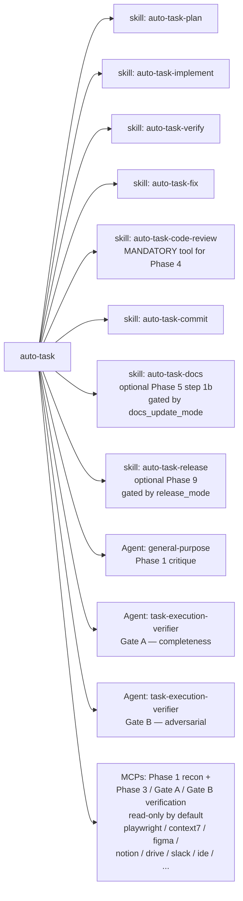

# auto-task — Architecture

End-to-end autonomous task pipeline. One human gate at plan approval; everything after runs unattended until success, a hard blocker, or test flakiness.

This document is a map of the moving parts: the pipeline phases, the artifacts on disk, the related skills/agents the pipeline composes, and the global settings (CLAUDE.md rules + pre-commit hook) that enforce its invariants.

---

## Pipeline diagram

```mermaid
flowchart TD
    Start([/auto-task &lt;description&gt;]) --> P1Setup[Phase 1 — Branch setup<br/>every run: fork feat|fix|chore/&lt;slug&gt; from fresh default branch<br/>git worktree add + EnterWorktree; fallback git switch -c<br/>already inside a worktree → run in place<br/>append .auto-task/ to git-common-dir/info/exclude<br/>init .auto-task/&lt;branch&gt;/STATE.json]
    P1Setup --> Recon{Recon trigger?<br/>UI / runtime / external lib /<br/>Figma / Notion / etc.}
    Recon -- yes --> ReconDo[MCP recon, read-only<br/>any MCP if necessary<br/>playwright / context7 / figma /<br/>notion / drive / slack / ide / ...]
    Recon -- no --> Approach
    ReconDo --> Approach{Multiple viable<br/>approaches?}
    Approach -- yes --> ApproachDo[Approach selection<br/>2-3 short candidate sketches<br/>inline or parallel agents by complexity<br/>score + select<br/>close-call/high-stakes → AskUserQuestion<br/>write PLAN.md ## Approach decision log]
    Approach -- no, single approach --> P1Plan
    ApproachDo --> P1Plan[Invoke skill: auto-task-plan<br/>break down chosen approach only<br/>append Acceptance Criteria table<br/>append Effort: D + R + tier<br/>critique Agent → re-plan loop<br/>auto-fix structural findings, cap by tier]
    P1Plan --> Preflight[AC pre-flight<br/>dry-run every AC command<br/>pin baselines<br/>sample-verify external-tool lists<br/>FP &gt; 20%? STOP and surface]
    Preflight --> Gate1{{HUMAN GATE<br/>user types: approved / proceed / yes}}
    Gate1 -- approved --> P2[Phase 2 — Execute<br/>skill: auto-task-implement<br/>drift check at each checkpoint<br/>NO COMMIT]
    Gate1 -- rejected --> StopUser([stop / wait])

    P2 --> P3[Phase 3 — Self-verify<br/>skill: auto-task-verify on uncommitted diff<br/>run every Gate=self-verify AC row<br/>MCPs allowed, read-only<br/>NO COMMIT]
    P3 --> P3OK{verify pass<br/>+ all self-verify AC pass?}
    P3OK -- no --> P3Fix[skill: auto-task-fix<br/>iteration.fix++<br/>re-score effort if drift<br/>Loop rule check]
    P3Fix --> P3
    P3OK -- yes --> GateA[Gate A — Independent verifier<br/>run every Gate=gate-a AC row<br/>spawn task-execution-verifier<br/>fresh context: diff + AC table<br/>NO COMMIT]

    GateA --> GateAOK{all AC satisfied?}
    GateAOK -- no --> GateAFix[Append findings as new tasks<br/>→ back to Phase 2]
    GateAFix --> P2
    GateAOK -- yes --> P4
    GateA -.- ACGate[MCPs allowed for AC<br/>bound-check execution<br/>read-only][Phase 4 — Code review loop<br/>skill: auto-task-code-review on working-tree diff<br/>default: invoked from a fresh-context general-purpose Agent<br/>grade findings by reachability, not by label<br/>NO COMMIT]

    P4 --> P4Rec[append gates.code_review.rounds[] row<br/>grade each finding: a AC breach / b runtime-reachable / c security<br/>fail closed on your own uncertainty]
    P4Rec --> P4Cls{graded findings?}
    P4Cls -- non-reopening blocker/required --> P4Def[defer to gates.code_review.deferred[]<br/>costs NO round — no new review pass]
    P4Def --> P4Cls
    P4Cls -- reopening: a / b / c --> P4Fix[skill: auto-task-fix<br/>re-run skill: auto-task-verify<br/>iteration.review++<br/>clean_pass_after_last_fix=false]
    P4Fix --> P4
    P4Cls -- reopening count did not decrease --> P4Conv[convergence test fired<br/>surface: user-approval<br/>do NOT set code_review.passed]
    P4Cls -- zero reopening, deferred non-empty AND batch NOT spent --> P4Batch[fix the WHOLE deferred set in ONE batch<br/>record the row with batch=true — spent once per run<br/>then exactly one re-review]
    P4Batch --> P4
    P4Cls -- zero reopening, deferred empty OR batch spent --> P4OK[park follow-ups in state<br/>post-batch non-reopening blocker/required parks at every tier<br/>set gates.code_review.passed=true<br/>tool='skill:auto-task-code-review'<br/>clean_pass_after_last_fix=true]

    P4OK --> GateBCap{passes for this scope<br/>&lt; lb_gate_b_cap?<br/>budget OK?}
    GateBCap -- at cap --> GateBSurface([SURFACE — per-pass severity table<br/>grant: +1 pass / park_non_blocking / descope<br/>expected_next_action=user-approval])
    GateBSurface -- "+1 pass" --> GateBCap
    GateBSurface -- park / descope --> GateBOK
    GateBCap -- under cap --> GateB[Gate B — Adversarial verifier<br/>spawn task-execution-verifier<br/>fresh context: AC + delta since verified_diff_sha + Phase-4 findings<br/>prompt flipped to 'find what's wrong'<br/>each finding carries ac: and reachable:<br/>NO COMMIT]

    GateB --> GateBCls{AC impact?<br/>breaks an AC / runtime-reachable<br/>regression / security-data-loss?}
    GateBCls -- yes, or ac: missing --> GateBFix[reset code_review.passed=false<br/>iteration.review++<br/>→ back to Phase 4]
    GateBFix --> P4
    GateBCls -- "no — park whatever the label" --> GateBOK[gates.gate_b.passed=true]
    GateBCls -- "2nd self_inflicted pass,<br/>or CONVERGED (count stopped falling)" --> GateBSurface

    GateBOK --> P5[Phase 5 — Handover<br/>SINGLE COMMIT phase]

    P5 --> P5Verify{verify gates:<br/>code_review.passed AND<br/>(gate_b.passed OR skipped_reason)}
    P5Verify -- missing --> StopBug([STOP — pipeline bug,<br/>do NOT bypass hook])
    P5Verify -- ok --> P5Docs{docs_update_mode?}
    P5Docs -- "skip / invalid value" --> P5Stage
    P5Docs -- "always / ask" --> P5DocsRun[skill: auto-task-docs<br/>staleness report first<br/>README.md + docs/** only]
    P5DocsRun -- "empty report" --> P5Stage
    P5DocsRun -- "ask + findings" --> P5DocsAsk{apply docs edits?<br/>degrades to always under<br/>autonomous / headless}
    P5DocsAsk -- no --> P5Stage
    P5DocsAsk -- yes --> P5DocsGate[re-verify + re-auto-task-code-review<br/>refresh reviewed_diff_sha<br/>reset + re-run Gate B on STANDARD/HEAVY]
    P5DocsRun -- "always + findings" --> P5DocsGate
    P5DocsGate --> P5Stage[git restore --staged .auto-task/<br/>git add &lt;planned files only&gt;<br/>confirm no .auto-task/ in index]
    P5Stage --> P5Commit[skill: auto-task-commit<br/>pre-commit hook validates gates]
    P5Commit --> P5Push{push?<br/>2nd of at most 2 Phase-5 prompts}
    P5Push -- yes --> P5PR[git push -u origin HEAD<br/>gh pr create]
    P5Push -- hold --> P9
    P5PR --> P6{bot_review_autofix<br/>enabled?}
    P6 -- yes --> P6Do[Phase 6 — post-PR bot-comment review<br/>poll bot comments, triage,<br/>auto-apply safe fixes via full<br/>verify → review → gate → commit → push loop<br/>MAY add gate-reviewed commits]
    P6 -- no --> P7
    P6Do --> P7{preview applicable?<br/>has_preview_deployment /<br/>autodetect + PR}
    P7 -- yes --> P7Do[Phase 7 — preview verification<br/>resolve preview URL, run URL-ACs,<br/>record PASS/FAIL/INCONCLUSIVE verdict]
    P7 -- no --> P9
    P7Do --> P9{release_mode?<br/>release terminal guard —<br/>checked at every done-writer}
    P9 -- "skip / invalid value / skill absent" --> Done
    P9 -- "landing is not an explicit direct" --> P9Defer[status deferred-pr<br/>release belongs on the default branch<br/>emit runbook for after the merge]
    P9Defer --> Done
    P9 -- "always / ask" --> P9Run[skill: auto-task-release<br/>report-only — derive bump + entry<br/>surface what release_command does]
    P9Run -- "nothing to release" --> Done
    P9Run -- "release_command unset" --> P9Book[status runbook<br/>paste-ready steps, nothing run]
    P9Book --> Done
    P9Run -. "report-only blocker &#40;pre-existing tag, absent<br/>CHANGELOG, command self-commits&#41;" .-> P9Part
    P9Run -- "ask + something to release" --> P9Ask{cut this release?<br/>degrades to always under<br/>autonomous / headless}
    P9Ask -- no --> Done
    P9Ask -- yes --> P9Apply
    P9Run -- "always + something to release" --> P9Apply[skill: auto-task-release — apply<br/>write changelog entry, run release_command,<br/>verify the bump landed — does NOT commit]
    P9Apply -. "non-zero release_command<br/>&#40;apply substep 4.2&#41;" .-> P9Part
    P9Apply --> P9Gate[re-verify + re-auto-task-code-review<br/>refresh reviewed_diff_sha<br/>reset + re-run Gate B on STANDARD/HEAVY]
    P9Gate -. "re-gate not clean" .-> P9Part
    P9Gate --> P9Cut[chore&#40;release&#41;: vX.Y.Z + annotated tag<br/>LOCAL ONLY — never push, never publish]
    P9Cut --> Done([phase=done, run recorded])
    P9Cut -. "interrupted / commit without tag" .-> P9Part([status in-progress / partial-failure / failed<br/>SURFACED for manual resolution —<br/>never auto-resumed, retried or reverted<br/>hands over the continuation AND the undo commands])

    %% Loop-rule global exits
    P3 -. no progress / out-of-scope /<br/>blocker / flakiness .-> Surface([Surfacing protocol<br/>save state, write status, wait])
    P4 -. no progress / out-of-scope /<br/>blocker / flakiness .-> Surface
    P2 -. drift outside plan intent .-> Surface
```

---

On a NEW run, before branch setup, Phase 1 also runs a best-effort **per-run version check** (`check-version.sh --plain`, throttle bypassed, bounded, fail-open) and asks once if a newer plugin version is published — separate from, and not affecting, the cached SessionStart update notice (the per-run check never writes the SessionStart throttle stamp). Skipped on resume.

## Phases at a glance

| Phase | Tool used | Commits? | Exit condition | Failure routing |
|---|---|---|---|---|
| 1 Define | approach selection + `auto-task-plan` skill + critique→re-plan loop | no | user types approval keyword | wait (or reject → stop) |
| 2 Execute | `auto-task-implement` skill | **no** | all PLAN.md tasks ticked | drift check escalates tier or stops |
| 3 Self-verify | `auto-task-verify` skill + literal AC commands | **no** | all checks pass + every `self-verify` AC pass | `auto-task-fix` skill → loop, capped by tier |
| Gate A | `task-execution-verifier` Agent + literal AC commands | **no** | every AC satisfied | findings → back to Phase 2 |
| 4 Code review | **`auto-task-code-review` skill** (no substitutes), by default invoked from a fresh-context `general-purpose` Agent (`review_in_subagent`; inline when off) | **no** | zero **reopening** findings (the Step-A grade, not the label) and `deferred[]` empty or spent — a `blocker`/`required` that breaks no AC, is not runtime-reachable and is not a security/data-loss path is **deferred**, not round-triggering. A post-batch non-reopening `blocker`/`required` **parks at every tier**, where Gate B re-grades it at every tier | a **reopening** finding → `auto-task-fix` → re-`auto-task-verify` → re-review, `iteration.review++`; a zero-reopening round with deferrals → fix the whole set in ONE batch (spent once per run) + one re-review; a fired convergence test (`reopened` did not decrease) **surfaces** (`user-approval`) |
| Gate B | `task-execution-verifier` Agent (adversarial) | **no** | no finding meets the Step-2 AC-impact test — so "No adversarial findings", only follow-ups, **or** findings labelled blocker/required that are parked because none breaks an AC / is runtime-reachable / is a security-data-loss path; a fired convergence test surfaces rather than exiting | a **reopening** finding resets `code_review.passed=false` and goes back to Phase 4; at the pass cap, on a second `self_inflicted` pass, or on a fired convergence test it **surfaces** instead (`user-approval`) |
| 5 Handover | optional `auto-task-docs` skill (step 1b) + `auto-task-commit` skill + `gh pr create` | **YES — single commit** (docs edits join it) | PR opened (or user holds push) | gates fail → surface (do not bypass hook) |
| 6 Bot-comment review (opt-in) | `pr-bot-comments.sh` + full verify → `auto-task-code-review` → gate → commit loop | **YES — gate-reviewed bot-fix commits** (only when `bot_review_autofix`) | bot comments triaged; safe fixes applied + pushed, rest parked | fork-PR / no-push → fail-open skip |
| 7 Preview verification (gated) | preview URL resolution + URL-AC checks (`playwright`/`curl`) | no | verdict PASS/FAIL/INCONCLUSIVE recorded (or handoff/timeout) | no URL → skip gracefully; FAIL → done-with-negative-verdict |
| 9 Release (gated, opt-in) | optional `auto-task-release` skill + the project's `release_command` | **YES — one gate-reviewed release commit** (+ annotated tag; only when `release_mode` is `always`/`ask`) | `chore(release): vX.Y.Z` committed and tagged **locally** — never pushed, never published | `release_command` unset → runbook; `landing_model=pr` → `deferred-pr`; command fails at apply substep 4.2 → `failed`; commit without tag → `partial-failure`, surfaced with the unwind |

Phases 2–4 accumulate one growing uncommitted diff against the base branch. **Phase 5 produces the single authored commit; the opt-in Phase 6 (bot-fixes) and Phase 9 (release) may add further authored commits, each individually gate-reviewed** (the only exceptions to "one commit" beyond the main-sync merge). Post-PR Phases 6–7 run only when a push happened.

---

## Effort tiers

Difficulty (D) and Risk (R) each scored 0–8 in Phase 1. Tier = `max(D, R)`.

| Tier | Range | `/auto-task-verify` scope | Fix-loop cap | Gate B |
|---|---|---|---|---|
| LIGHT | 0–2 | types + unit | 2 | run, max 1 pass |
| STANDARD | 3–5 | types + unit + lint | 4 | run, max 2 passes |
| HEAVY | 6–8 | types + unit + lint + build (+ e2e if touched) | 6 | run, max 3 passes, cross-check |

The **Fix-loop cap** column is a hook-enforced budget, not a suggestion — see SKILL.md → "Fix-loop budget". Both enforcing hooks read the numbers from `hooks/lib/loop-budget.sh`, which is the single executable definition; this table and SKILL.md's document that file rather than duplicating it, so a cap change happens in one place.

The **Gate B pass cap** is a *second, independent* bound and must not be conflated with the fix-loop cap. They differ on what they count and when they bite: the fix-loop cap counts **rounds of iteration** (`max(iteration.fix, iteration.review)`) and is read by `enforce-gates.sh` at **commit time**; the pass cap counts **adversarial passes** and is checked by the orchestrator at **Gate-B entry**. Both come from `hooks/lib/loop-budget.sh` (`lb_cap_for_tier`, `lb_gate_b_cap`). The entry check exists because the commit-time block cannot bound this loop at all — the loop never commits, which is how a real run reached 28 review rounds against a HEAVY cap of 6 without the budget ever being consulted.

Each of the four sites that re-run Gate B after the main loop (Phase-5 docs, Phase-5 merge-conflict finalize, Phase-6 bot-fix, Phase-9 release) draws on a **separate** allowance, `lb_gate_b_regate_cap`, **per site per run**. Separate because a re-gate sharing the main-loop count could never re-earn `gates.gate_b.passed` once the main loop spent it — and since a `false` flag blocks the handover commit, the run would deadlock with no route forward. Per-run-not-per-round because Phase 6 and the docs step can each execute more than once, and a renewing allowance would rebuild the unbounded loop inside the re-gate.

Unlike the fix-loop cap, the pass cap is **not** hook-enforced: a Gate B pass is an `Agent` spawn, and `hooks/hooks.json` registers `PreToolUse` only for the `Bash` matcher, so no hook observes one (and identifying a spawn by its `label` is forbidden — the run label is cosmetic and never changes control flow). It is a model-honored contract whose mechanical backstop remains the commit-time gate. **The gate-table read list below is therefore unchanged by the pass cap.**

Tier can only **escalate** — never auto-de-escalate. Every change is logged to `effort.history` with `{from, to, reason, at}`. Re-score hooks fire on drift (Phase 2 checkpoints) and on fix-cap exhaustion (Phase 3, Phase 4).

---

## State file — `.auto-task/<branch>/STATE.json`

The pipeline is fully resumable. State is updated at every phase transition and every loop iteration. `<branch>` mirrors `git branch --show-current` verbatim (slashes preserved), so the gate and Stop hooks resolve the same path.

The block below is **abridged** for readability — the full JSON schema (including `title`, `estimate`, `actuals`, `quality`, `checks`, `requirements`, `settings`, `bot_review`, and `preview`) lives in `SKILL.md` → "State file", and the per-object semantics (additive rules, null-vs-zero, the terminal-vs-in-flight honesty rules) live in `skills/auto-task/references/state-schema.md`.

```json
{
  "phase": "define|execute|self-verify|gate-a|review|gate-b|handover|bot-review|preview|done",
  "expected_next_action": "auto-continue|user-approval|user-push-prompt|awaiting-agent|null",
  "approved": true,
  "description": "<verbatim task input>",
  "branch": "<resolved branch name>",
  "base": "<base-commit SHA the run's diff is measured against>",
  "effort": {
    "tier": "light|standard|heavy",
    "difficulty": 0,
    "risk": 0,
    "history": [{ "from": "...", "to": "...", "reason": "...", "at": "ISO-8601" }]
  },
  "iteration": { "review": 0, "fix": 0 },
  "history": [{ "phase": "...", "result": "...", "summary": "...", "at": "ISO-8601" }],
  "gates": {
    "self_verify": { "passed": false, "at": null, "evidence": null },
    "gate_a":      { "passed": false, "at": null, "evidence": null },
    "code_review": { "passed": false, "tool": null, "clean_pass_after_last_fix": false, "reviewed_diff_sha": null, "at": null, "evidence": null, "rounds": [], "deferred": [], "subagent_disabled": false },
    "gate_b":      { "passed": false, "at": null, "evidence": null, "skipped_reason": null,
                     "verified_diff_sha": null, "allowance_acked": {},
                     "passes": [{ "n": 1, "scope": "main", "blockers": 0, "required": 0, "followups": 0,
                                  "self_inflicted": false, "fixed_lines": [], "diff_sha": null, "at": "ISO-8601" }] },
    "loop_budget": { "acked_through": 0, "acked_at": null, "reason": null, "park_non_blocking": false }
  },
  "followups": [{ "source": "code-review", "note": "...", "at": "ISO-8601" }],
  "pr_url": null
}
```

`.auto-task/` is **never committed**. Its root is added to the common-dir exclude (`$(git rev-parse --git-common-dir)/info/exclude` — that is `.git/info/exclude` in a normal checkout and the shared common dir from any linked worktree; per-clone, never to the repo's `.gitignore`) and pre-stage-cleaned before every commit.

### `.auto-task/<branch>/` layout during a run

```
.auto-task/
└── <branch>/                 # branch path preserved verbatim (fix/foo → .auto-task/fix/foo/)
    ├── STATE.json            # state machine (see above)
    ├── PLAN.md               # plan + Approach + Critique + Acceptance Criteria + Pre-flight + Recon
    ├── CONTEXT.md            # Phase 5 handover artifact (regenerated each Phase 5)
    ├── TRACE.md              # append-only operation log
    ├── recon/                # Phase 1 reconnaissance + change-diagram.mmd + before/after screenshots + visual-changes.json (hosted URLs)
    ├── fixes/                # per-fix patch notes (auto-task-fix lessons)
    └── artifacts/            # proofs of completion (tests, screenshots, diffs, logs)
```

---

## Acceptance Criteria contract

Phase 1 cannot complete without an `## Acceptance Criteria` table in `.auto-task/<branch>/PLAN.md`. Every row must be:

1. **Observable** — third-party-witnessable outcome, not "auth works correctly".
2. **Bound to a check** — concrete command/assertion/observation, not "manually check".
3. **Falsifiable** — comparable expected value (exit code, status, selector absent), not "no problems".
4. **Gate-bound** — `self-verify` | `gate-a` | `gate-b`.
5. **Complete** — covers every behavior the task description promises.

`gates.self_verify.passed` cannot be set unless **every** `self-verify`-gated AC has a recorded pass from the current iteration. Same for `gate_a`. There is no escape hatch.

---

## Composed skills and agents


```mermaid
flowchart LR
    AT[auto-task] --> Plan[skill: auto-task-plan]
    AT --> Implement[skill: auto-task-implement]
    AT --> Verify[skill: auto-task-verify]
    AT --> Fix[skill: auto-task-fix]
    AT --> CR[skill: auto-task-code-review<br/>MANDATORY tool for Phase 4]
    AT --> Commit[skill: auto-task-commit]
    AT --> Docs[skill: auto-task-docs<br/>optional Phase 5 step 1b<br/>gated by docs_update_mode]
    AT --> Rel[skill: auto-task-release<br/>optional Phase 9<br/>gated by release_mode]
    AT --> Critique[Agent: general-purpose<br/>Phase 1 critique]
    AT --> TEV_A[Agent: task-execution-verifier<br/>Gate A — completeness]
    AT --> TEV_B[Agent: task-execution-verifier<br/>Gate B — adversarial]
    AT --> MCPs[MCPs: Phase 1 recon +<br/>Phase 3 / Gate A / Gate B verification<br/>read-only by default<br/>playwright / context7 / figma /<br/>notion / drive / slack / ide / ...]
```

- **`auto-task-plan`** — produces the implementation plan for the chosen approach. Auto-task runs approach selection first (2–3 candidate sketches scored and selected, close calls folded into the human gate), then appends Acceptance Criteria + Effort + Critique. The critique runs as a bounded re-plan loop: structural-fixable findings are auto-amended and re-critiqued (cap by tier); only judgment-required findings reach the human.
- **`auto-task-implement`** — ticks off plan tasks; auto-task interprets each `<!-- DRIFT CHECKPOINT -->` as a **drift-check** marker (not a commit marker).
- **`auto-task-verify`** — runs types/lint/build/tests; auto-task also runs literal AC commands on top.
- **`auto-task-fix`** — invoked on any failure; modifies the working tree, never commits during a run.
- **`auto-task-code-review`** — 5-phase Investigate → Define → Execute → Prevent → Verify. **Hard-required** in Phase 4, and by default invoked from a fresh-context `general-purpose` Agent rather than in the main loop (`review_in_subagent`). Hand-rolled review prompts stay forbidden at **both** call sites, and the pre-commit hook rejects any other `gates.code_review.tool` value — it reads that field only, so it cannot and need not see where the skill ran.
- **`auto-task-commit`** — used in Phase 5 only; pre-commit hook validates gates first.
- **`auto-task-release`** — **optional**, **Phase 9** (the last phase), gated by `release_mode` (`skip` default / `always` / `ask`). Cuts a release for work that already landed: derives the version bump *with its evidence*, writes the `CHANGELOG.md` entry, runs the project's `release_command` (never hand-editing a version manifest — unset means a runbook, not a guess), then commits `chore(release): vX.Y.Z` and an annotated tag. **Local only — never pushes, never publishes.** Returns the release plan *before* acting, so `ask` never prompts when there is nothing to release; the commit re-passes the full gate loop first (Exception 3 to the single-commit rule) and is fully unwindable (`git tag -d` + `git reset --hard HEAD~1`).
- **`auto-task-docs`** — **optional**, Phase 5 step 1b, gated by `docs_update_mode` (`skip` default / `always` / `ask`). Refreshes user-facing docs the run made stale, scoped to `README.md` + `docs/**` (never `CHANGELOG.md`, `CLAUDE.md`, or code comments). Returns a `file:line` staleness report *before* editing, so `ask` never prompts on a docs-current run; edits land in the single handover commit and force a re-verify + re-review (+ Gate B re-run on STANDARD/HEAVY).
- **`task-execution-verifier`** — spawned twice. Gate A asks "is this complete?"; Gate B flips to "find what's wrong" (adversarial). Both get fresh context (diff + AC only — no conversation history).

---

## Global rules referenced from `~/.claude/CLAUDE.md`

These rules are enforced project-wide and the pipeline depends on them:

- **Commit messages — no AI-attribution markers.** No `Co-Authored-By: Claude`, no `🤖 Generated with [Claude Code]`. Enforced both by the skill's Phase 5 instructions and by a global `PreToolUse` Bash hook that blocks any `git commit -m`/`gh pr create --body` containing those strings.
- **Code review — always the skill.** Never a `code-reviewer` agent or a hand-rolled review prompt, whether the skill is invoked inline or from the spawned reviewer agent (`review_in_subagent`). Re-invoke after every fix. Mirrored by the pre-commit hook check on `gates.code_review.tool === "skill:auto-task-code-review"`.
- **Mid-protocol non-yielding.** A sub-skill/sub-agent report is **input** to the next step, not an end-of-turn. The only legitimate stops between Phase 1 approval and Phase 5 are: a Loop-rule trigger, the Phase 5 push prompt, the Phase 5 docs-update ask (`docs_update_mode: ask`, and only when the docs step proposes a change), or a destructive-action confirmation per "Executing actions with care". Past Phase 5 the post-PR phases add their own documented surfaces, including the Phase 9 release ask (`release_mode: ask`, and only when there is something to release).
- **Task Execution Protocol — Define → Execute → Verify.** Mirrored 1:1 by auto-task's phase structure.

---

## Global settings — `~/.claude/settings.json`

Three `PreToolUse` Bash hooks back the contract:

### Hook 1 — block AI-attribution in commit messages

```text
matcher: Bash
trigger: any command containing
  Co-Authored-By: Claude
  | Generated with [Claude Code]
  | 🤖 Generated
action: exit 2 with explanation pointing at ~/.claude/CLAUDE.md
```

### Hook 2 — enforce gates on `git commit`

Runs only when:
- the command is a `git commit` (regex-matched at line/pipe boundaries),
- `.auto-task/<branch>/STATE.json` exists (branch from `git branch --show-current`),
- `approved === true`,
- `phase !== "done"`.

Then it reads the state file and **blocks the commit** unless ALL of:

| State field | Required value |
|---|---|
| `gates.code_review.passed` | `true` |
| `gates.code_review.tool` | `"skill:auto-task-code-review"` (literal — agents/hand-rolled prompts rejected) |
| `gates.code_review.clean_pass_after_last_fix` | `true` |
| `gates.code_review.reviewed_diff_sha` | must equal `git diff <pinned-flags> <base> \| git hash-object --stdin` recomputed at commit time, where `<pinned-flags>` = `--no-color --no-ext-diff --no-textconv --no-renames --diff-algorithm=myers --src-prefix=a/ --dst-prefix=b/` (skipped if `base`/`reviewed_diff_sha` absent) |
| `gates.gate_b.passed` OR `gates.gate_b.skipped_reason` | one of them set, unless `tier === "light"` |
| the diff's own content, via `hooks/checks.sh` | no `fail` row — the **diff-hygiene gate**. This is the FIRST row decided by the diff rather than by a state field, which is the point of it: every other row above is a boolean or a hash the model wrote, so the hook was fail-closed about review *bookkeeping* and blind to review *content*, and a diff carrying a real `AKIA…` key committed with every gate green. The hook runs `checks.sh --base <base>` from `project_dir` and blocks on any `fail` row (`secret-scan`, `conflict-markers`, `test-integrity`); `warn`/`info`/`pass` never block, so the scanner's test/fixture-path demotion still lets a fixture credential through. **Fail-open lives in the scanner, fail-closed lives in the gate:** `checks.sh` emits all-`skip` when it cannot inspect the diff — correct for its Phase-3 metrics caller, and *not* a clean bill of health here — so all-`skip`, a missing `checks.sh`, and non-row output each BLOCK, and that holds for **either** scan independently (an unusable index scan blocks even when the worktree scan was clean, since half of what the commit carries went unexamined). The scanner also reads the diff with pinned flags, enumerates paths NUL-delimited, and decides binary-ness from the diffed content rather than `numstat` — so `diff.external`/textconv, a `.gitattributes` `-diff`/`binary` attribute, and a non-ASCII or tab-bearing filename are each unable to switch a content check off. The filename case required no repo config at all (`core.quotePath` defaults to true, and a C-quoted path resolved to nothing), which made it the most reachable of the three. `checks.sh`'s **fail-open contract is unchanged** (its default invocation is byte-for-byte identical, so the Phase-3 metrics caller is unaffected); only this caller reinterprets its silence. Scope is the **worktree UNION the index** — the scanner runs twice (`--base` and `--base --cached`) and a `fail` from either blocks. Both halves are needed: the worktree scan matches `reviewed_diff_sha` and the single-commit rule under which the whole worktree diff is the run's work, while the index scan exists because `git commit` commits the **index** — content staged and then edited out of the worktree is structurally invisible to `git diff <base>`, so a credential could otherwise be staged, removed from the file, and committed with every row green. Index-only findings are tagged as such in the block message. Skipped when `base` is absent (legacy runs), exactly like the staleness row. **Known limit, by design:** the scanner is per-file and rename-blind (`--no-renames`), so a test-file rename or deletion reports `test-integrity` — the block message names those false-positive shapes explicitly and points at the ack rather than telling the user to restore a file they meant to remove. A genuine false positive is cleared ONLY by a `gates.hygiene.acked[]` entry naming that check and pinned to the current diff hash (sentinel `scanner-unavailable` for an all-`skip`/missing-scanner block) — so, unlike every other block here, no state edit clears a real finding: the remedy is to fix the diff. |
| loop count vs the tier's fix-loop cap | `max(iteration.fix, iteration.review)` must not exceed `max(cap, gates.loop_budget.acked_through)` — the **loop-budget gate**. Both counters count: `fix` is bumped only on the Phase-3 self-verify failure path, while every Phase-4 review round and Gate-B feedback round bumps `review`, so a `fix`-only gate would wave through a `fix:0 / review:28` run. Caps come from `hooks/lib/loop-budget.sh` (LIGHT 2 / STANDARD 4 / HEAVY 6). Skipped for a legacy run missing EITHER side — no `effort.tier`, or no `iteration` counters at all (the code is `has_effort && has_iter`, so either absence skips the gate); fails **closed** if any value is non-numeric — including one that is all digits but too wide for a 64-bit compare, which errors in `[ ]` exactly like a non-numeric string and would otherwise fail open. **This table is the authoritative enumeration of what `enforce-gates.sh` reads** — other docs point here rather than restating it, because every restatement has gone stale. Gate-deciding reads: `gates.*`, `effort.tier`, `iteration.fix`, `iteration.review`, and `base` (both the staleness row above and the diff-hygiene row depend on its value). Gate-deciding reads OUTSIDE the state file: the **diff content itself**, via `hooks/checks.sh` (the hygiene row) — noted explicitly because "what the hook reads" is otherwise natural to read as "which state fields it reads", and that framing is now incomplete. Applicability-only reads: `approved`, `phase`, `cwd`, and the tool payload. Adding a read means updating this row. |

The first four bind to a single code-review pass, and the `reviewed_diff_sha` row additionally proves the committed diff is the one that was reviewed — code edited after the gate went clean produces a hash mismatch and is blocked. The **diff-hygiene row is orthogonal in a different direction**: those five rows all ask *"was the review performed, and does it cover these bytes?"* — a question answered entirely by fields the model wrote — while hygiene asks *"what do these bytes actually contain?"*, and answers it deterministically without trusting the model at all. It is placed after them deliberately: a run whose review has not passed hears that first (it is still legitimately working), and content hygiene outranks a volume check. The **loop-budget row is orthogonal** to all of that: it bounds review *volume* rather than review quality, and is the anti-churn counterpart to the anti-stall Stop hook, added because the tier caps had been documented but never enforced. The hook is the single point of mechanical enforcement that makes the **single-commit rule** real. Bypassing it (e.g., `--no-verify`) is forbidden by global rules.

This hook also carries the **checkout-drift block**: when the command is a `git commit` but there is NO state for the current branch, it scans this working tree's `.auto-task/` and — if an active run (`approved && phase !== "done"`) exists on a *different* branch — blocks with `exit 2` (switch back or clear the abandoned run). This closes the previous silent fail-open where a checkout moved off an in-place run's branch and let an ungated commit land on the wrong branch. Requires `jq` (without it, drift cannot be proven, so no block is manufactured); scope is the current working tree only, so a parallel run in another worktree can never trigger it.

### Hook 3 — warn on checkout drift

The informational, never-blocking counterpart to the drift block above. Fires on every Bash command; when the current branch owns no active run yet another branch in this working tree does, it warns (via PreToolUse `additionalContext` + stderr) that the checkout drifted and that commits are hard-blocked until the user switches back or clears the abandoned run. Cheap early exits (not a repo / no `.auto-task/` dir / `jq` absent) keep non-auto-task sessions silent and near-free. Mirrors `inject-history-reminder`'s "informational, always `exit 0`" contract — of the PreToolUse hooks only the enforce-gates commit gate blocks. (The Stop hook `prevent-mid-protocol-stall.sh` blocks too, but a turn-end rather than a command — and since the loop-budget gate it also *releases* one turn-end per over-budget iteration so the run can surface its check-in. It releases in one further case: `expected_next_action: "awaiting-agent"`, when a spawned Agent's report is still in flight and yielding is the only way the harness can deliver it. That release is capped at `AUTO_TASK_AGENT_WAIT_LIMIT` consecutive turn-ends in an unchanged state, because no hook can observe an `Agent` spawn — `PreToolUse` is registered for the `Bash` matcher only — so an uncapped release would be an unbounded stall hatch. The primary fix is a synchronous spawn (`run_in_background: false`); this is the backstop for a harness that backgrounds it anyway.)

### Recommended permissions (NOT shipped by the plugin — opt-in)

The plugin ships only hooks in `settings-fragment.json`. It does **not** impose
permissions, because denying `git push` globally would affect all of the user's
work, not just auto-task runs. The Phase 5 push is already user-confirmed by the
skill itself (it sets `expected_next_action: "user-push-prompt"` and asks once
before the network call), and the harness's own `gh pr create` permission prompt
provides a second confirmation. The permissions below are an **optional**
defence-in-depth backstop a user may add to `~/.claude/settings.json`:

```json
{
  "permissions": {
    "deny":  ["Bash(git push:*)", "Bash(git push)"],
    "ask":   ["Bash(gh pr create:*)", "Bash(gh pr merge:*)"]
  }
}
```

- With `git push` in **deny**, Phase 5's push becomes an unbypassable user-confirmed action.
- With `gh pr create` in **ask**, PR creation always surfaces a permission prompt, doubling as the Phase 5 "push/PR/hold" gate.

If a user does not add these, the run is still safe — the skill's single push prompt is the gate; the permissions just make it mechanical rather than instruction-backed. `settings-fragment.json` carries this same block under an `_optional_recommended_permissions` key (inert, for copy-paste).

---

## Surfacing protocol (Loop-rule trigger)

When ANY of these is true mid-pipeline, the run stops and waits:

1. **No progress** — two consecutive iterations with no measurable improvement.
2. **Out-of-scope** — remaining issues don't map to approved Acceptance Criteria.
3. **External blocker** — missing creds, broken infra, undecided design, third-party outage.
4. **Test flakiness** — non-deterministic failure (passes on retry without code change).

State is saved. The user gets a short status message: **why stopped** + **what's done / pending / failing** + **suggested next move**. Do not auto-resume — wait for the user. Resume with `/auto-task` (no args).

---

## Invariants (the contract)

- **Single authored commit (+ documented exceptions).** Phase 5 produces the one authored commit — guaranteed by the pre-commit hook + the skill's per-phase "NO COMMIT" rule. The only additional commits permitted are the main-sync merge commit and (opt-in) the Phase-6 bot-fix commits, each of which is individually gate-reviewed before it lands.
- **`.auto-task/` never committed.** Excluded via the common-dir exclude (`$(git rev-parse --git-common-dir)/info/exclude`), pre-stage-cleaned at every commit. A leaked commit means a bug — surface, do not silently rewrite history.
- **One human gate** between approval and PR. Plus one allowed prompt in Phase 5 (push/PR/hold). When a push happens, the post-PR phases may legitimately surface as documented yields (a Phase-6 bot-flagged blocker, or a Phase-7 preview handoff/timeout where verification is still owed) — these are yields, not new gates.
- **Acceptance Criteria are load-bearing.** No gate can pass without literal execution of its bound AC rows.
- **The reviewed diff is the committed diff.** The code-review gate records a hash of `git diff <base>`; the commit is blocked unless the diff still hashes identically, so post-review edits can't sneak in uncommitted-by-review.
- **Effort can only escalate.** Manual de-escalation requires editing `Effort:` in `.auto-task/<branch>/PLAN.md`.
- **Fresh-context agents.** Both `task-execution-verifier` spawns receive only `{ diff, AC }` — never conversation history.
- **Pre-existing user work is preserved.** Pre-staged files at run start are recorded as baseline and excluded from every auto-task commit.

---

## Parallel runs (automatic worktree isolation)

Run state is keyed by branch under `.auto-task/<branch>/`, and the gate + Stop hooks resolve their project dir from `git rev-parse --show-toplevel` (the working tree the command actually runs in), so each linked git worktree is a fully isolated run:

- **Automatic on every run, from any branch.** Phase 1 no longer `git switch -c`s the shared checkout. For every new-description run it forks a fresh `<type>/<slug>` branch **from the repo's default branch** (`main`/`master`, best-effort fetched first) and creates it in its own worktree — `git worktree add .claude/worktrees/<type>-<slug> -b <branch> <default-ref>` — then relocates the session in via the `EnterWorktree` tool. This happens regardless of what branch you are currently on: nothing to set up, and it never matters what the shared checkout is doing. The worktree is kept on disk after the run (prune manually with `git worktree remove`).
- **Based on the default branch, not the current HEAD.** Every run starts from a clean, current default base, so it never inherits the current checkout's branch identity or uncommitted WIP. Consequence: a run started while on a feature branch forks fresh from the default rather than continuing that branch. To base a run on specific work, prepare a worktree for it by hand and run `/auto-task` inside it.
- **Manual is still fine.** `git worktree add ../wt-x -b feat/x` then invoke `/auto-task` inside it — auto-task detects it is already inside a linked worktree (comparing the **absolute** git-dir against the absolute common-dir, so the check is correct from any subdirectory) and runs in place there on the prepared branch without nesting a second worktree.
- State, gates, and the Stop-hook yield enforcement are per-worktree; concurrent runs never cross-talk, even though they share one clone's object store and common-dir exclude file. git forbids two worktrees on the same branch, and branch/worktree-dir names are disambiguated before creation, so collisions can't happen.
- **The in-place fallback is guarded.** The only path that operates in the shared checkout is the fallback (when `EnterWorktree`/`git worktree add` is unavailable). The checkout-drift guard (enforce-gates block + `warn-checkout-drift.sh`) catches the case where the working tree is switched off that run's branch underneath it, instead of silently failing open — a safety net for the fallback, not the normal path.

---

## Related files

| Path | Role |
|---|---|
| `~/.claude/skills/auto-task/SKILL.md` | The skill spec — the always-loaded **spine** (source of truth for the pipeline, loop rule, effort tiers, yield-point contract, AC contract + INCONCLUSIVE floor, trace contract, and each phase's gate condition + non-negotiables) |
| `~/.claude/skills/auto-task/references/*.md` | The spec's **on-demand half** — seven files (`phase-1-preamble`, `phase-3-gates`, `phase-5-handover`, `phase-6-8-post-pr`, `phase-9-release`, `settings`, `state-schema`) holding the full step-by-step contracts. Only `SKILL.md` is context-injected; the spine cites each reference with a `**MANDATORY READ:**` directive at its point of use. Guarded by `tests/spec-inventory.sh` (no content lost, no heading duplicated) and the spine-only assertions in `tests/enforcement-spine.test.sh` |
| `~/.claude/skills/auto-task-plan/SKILL.md` | Composed by Phase 1 |
| `~/.claude/skills/auto-task-implement/SKILL.md` | Composed by Phase 2 |
| `~/.claude/skills/auto-task-verify/SKILL.md` | Composed by Phase 3 |
| `~/.claude/skills/auto-task-fix/SKILL.md` | Composed by Phases 3, 4, Gate A, Gate B |
| `~/.claude/skills/auto-task-code-review/SKILL.md` | **Mandatory** tool for Phase 4 |
| `~/.claude/skills/auto-task-commit/SKILL.md` | Composed by Phase 5 |
| `~/.claude/skills/auto-task-docs/SKILL.md` | **Optional**, composed by Phase 5 step 1b when `docs_update_mode` is `always`/`ask` |
| `~/.claude/skills/auto-task-release/SKILL.md` | **Optional**, composed by Phase 9 when `release_mode` is `always`/`ask` |
| `~/.claude/CLAUDE.md` | Global rules: commit-message ban, code-review-skill rule, non-yielding, DoD |
| `~/.claude/settings.json` | Where the hooks are wired on the `install.sh`/manual fallback (marketplace installs use `hooks/hooks.json`): gate enforcement, AI-attribution ban, anti-stall, checkout-drift. The `git push` deny / `gh pr create` ask permissions are **opt-in, not shipped** (see "Recommended permissions"). |
| `<project>/.auto-task/<branch>/STATE.json` | Per-run state machine (resumable) |
| `<project>/.auto-task/<branch>/PLAN.md` | Per-run plan + Approach + AC + Effort + Critique |
| `<git-common-dir>/info/exclude` | Per-clone `.auto-task/` exclusion — `.git/info/exclude` in a normal checkout, the shared common dir from any worktree (never modifies repo `.gitignore`) |
